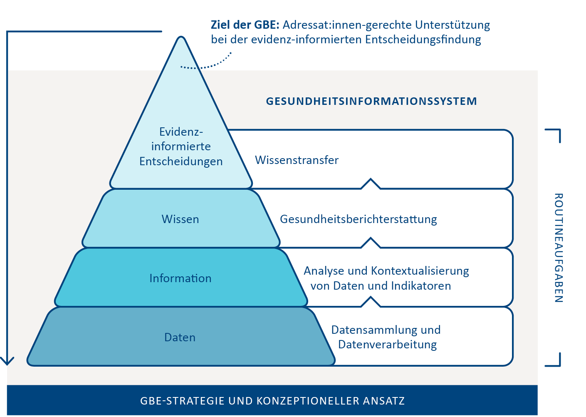
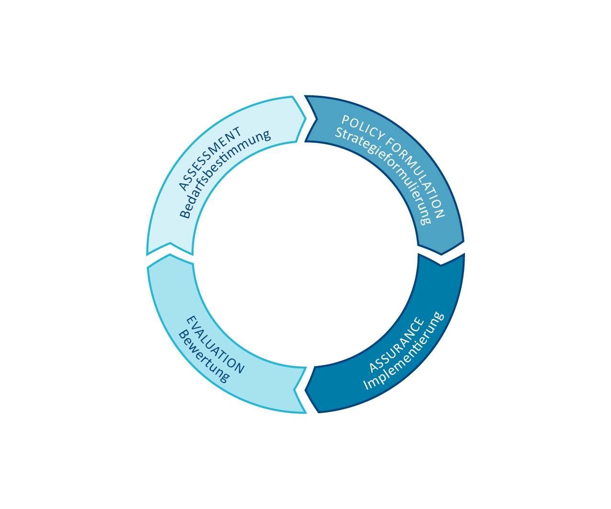
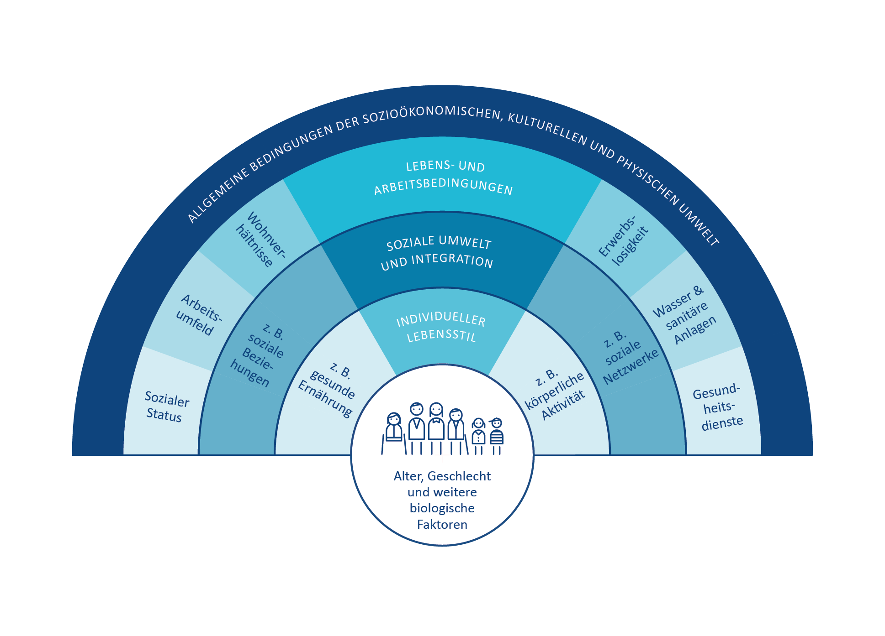

# 2. Wozu Gesundheitsberichterstattung

 
  
 
      &#9658; Inhaltsverzeichnis Kapitel (ausklappbar) 
  

 
1. TOC
{:toc}
 

 
 
> „GBE steht halt im Gesetz, darum mach ich das.  
> Wüsste nicht, dass da ein tieferer Sinn hinter ist ...“

Veränderungen im Krankheitsspektrum, demografischer Wandel, Klimawandel
und die Zunahme sozialer wie gesundheitlicher Ungleichheiten sind
weltweit sich gegenseitig bedingende Herausforderungen für die
Gesellschaft und Public Health und stellen keinesfalls eine erschöpfende
Aufzählung dar. Verlässliche und gut aufbereitete
Gesundheitsinformationen sind zentrale Voraussetzungen für die
Entwicklung passgenauer Strategien und Maßnahmen, um auf diese
Herausforderungen angemessen zu reagieren und die Bedingungen für
Gesundheit in jeder Alters- und Bevölkerungsgruppe zu fördern und zu
stärken. Gesundheitsberichterstattung ist dabei das zentrale Instrument
für die Bereitstellung gesundheitsrelevanter Informationen, kann
gleichzeitig aber nicht auf die bloße Aufbereitung von Daten reduziert
werden. Basierend auf einer übergeordneten (bzw. im Bild der
Informationspyramide untergeordneten) Gesamtstrategie kann die GBE
maßgeblich dazu beitragen, relevante Gesundheitsinformationen
wissenschaftlich aufzubereiten und für den (kommunalen) Bedarf
passgenaue Maßnahmen und Konzepte zu erarbeiten, wie in der bereits aus
[Kapitel 1]({{ site.baseurl }}) bekannten Informationspyramide im Folgenden noch einmal
visualisiert:

 <figure>
  
  <figcaption>Abbildung 3: „Routineaufgaben der GBE anhand der Informationspyramide (erweiterte Darstellung nach Verschuuren, van Oers 2019)
</figcaption>
</figure> 

## 2.1. GBE als Instrument der wissenschaftlichen Politikberatung

Gesundheitsberichterstattung gibt nicht nur einen Überblick über die
gesundheitliche Lage der Bevölkerung, sie dient auch explizit der
Analyse von Problemlagen und dem Aufzeigen von Handlungsbedarfen und im
Idealfall von Handlungsoptionen (Starke et al. 2019). In den letzten 35
Jahren hat sich die GBE damit zu einem zentralen Element
gesundheitspolitischer Entscheidungen sowie zu einer wesentlichen
Grundlage für partizipative Prozesse entwickelt (Brand, Michelsen 2007).
Auf Bundes-, Landes- und kommunaler Ebene dient die GBE als Instrument
der wissenschaftlichen Politikberatung und ist wichtige Ausgangsbasis
für die Gesundheitsplanung (siehe auch [Kapitel 7]({{ site.baseurl }})). Dieses umfangreiche
Aufgaben- und Funktionsprofil wird häufig anhand des
gesundheitspolitischen Planungsmodells der Public Health Trias
(Institute of Medicine (U.S.) 1988) bzw. dem darauf basierenden Public
Health Action Cycle (PHAC) beschrieben (Rosenbrock 1995) und ist in
Abbildung 3 dargestellt.
 <figure>
  
  <figcaption>Abbildung 3: Public Health Action Cycle (eigene Darstellung nach Rosenbrock 1995 und Institute of Medicine (U.S.) 1988)
</figcaption>
</figure> 

Ausgangspunkt des als Kreislauf angelegten Modells ist die in der Praxis
nicht immer gegebene Voraussetzung, dass die (gesundheitliche)
Ausgangssituation zunächst in möglichst vielen ihrer sozialen,
epidemiologischen sowie medizinischen Aspekten skizziert werden muss,
bevor passende Handlungsoptionen, Strategien und Maßnahmen zur
Verbesserung der gesundheitlichen Lage oder zur Reduktion
gesundheitlicher Ungleichheiten eruiert und umgesetzt werden können
(Rosenbrock 1995). In Form einer umfangreichen Bestands- und
Bedarfsanalyse **(Assessment)** liefern die im Rahmen der GBE
aufbereiteten und kontextualisierten Daten die zentrale Grundlage für
die Maßnahmenplanung und Entwicklung von Zielvorstellungen **(Policy
Formulation)**, was gerade in Zeiten knapper Ressourcen für die im
Modell folgende Implementierung von Maßnahmen **(Assurance)** von
zentraler Bedeutung ist. Letzteres impliziert auch, dass die Wirkungen
der umgesetzten Strategien und Maßnahmen in geeigneter Form gemessen und
bewertet werden müssen **(Evaluation)**, was idealerweise wiederum in
einem Re-Assessment der (gesundheitlichen) Ausgangssituation mündet. In
der Theorie soll dieser spiralförmige Verlauf dazu führen, dass sich die
Public-Health-Praxis immer besser an die zugrunde liegenden Probleme und
Herausforderungen anpasst und damit kontinuierlich wirksamer werden soll
(Rosenbrock 1995). In der Realität geht die GBE meist weit weniger
idealtypisch zyklisch und stets progressiv vonstatten. Das
verkompliziert die Arbeit in der GBE, es macht sie gleichzeitig aber
auch abwechslungsreich und spannend. So kann die Rolle der GBE bezüglich
der einzelnen Phasen des PHAC unterschiedlich sein (Brand, Michelsen
2007): Die Berichterstattung kann sich auf ihr Kerngeschäft des
Assessments und gegebenenfalls der Evaluation beschränken, sie kann
ebenso bei der Entwicklung passender Handlungsoptionen sowie der
Implementierung geeigneter Maßnahmen behilflich sein. Auch ihr Beitrag
bei der Ermittlung des Handlungsbedarfs kann unterschiedlich aussehen:
So kann es der GBE obliegen, prioritäre Handlungsfelder zu
identifizieren (Brand, Evans 1998), sie kann aber auch vor allem dazu
beitragen, Entscheidungsbedarfe in bestimmten Problemfeldern aufzuzeigen
(Kuhn 2005). In der Praxis ist die Beantwortung dieser Fragen oft von
den jeweiligen Rahmenbedingungen sowie der strukturellen Einbindung der
GBE in die Kommunalverwaltung abhängig, worauf in [Kapitel 3]({{ site.baseurl }}) noch
genauer eingegangen wird.

Erschwerend kommt hinzu, dass auch die Auswahl der zu bearbeitenden
Themen und Probleme selbst sowie deren Ursachenzuschreibung und
entsprechende Lösungsansätze von unterschiedlichen Interessens- und
Machtkonstellationen auf Umsetzungsebene bzw. im Interventionsfeld
abhängig sind (Kühn 1993, zit. nach Rosenbrock 1995). Schon allein
deswegen kann und sollte Gesundheitsberichterstattung nicht nebenbei im
„stillen Kämmerlein“ vonstattengehen, sondern sollte, wenn möglich,
von Anfang an als Gemeinschaftsaufgabe verstanden werden, die im
Idealfall auf mehrere Schultern verteilt wird und unterschiedliche
Perspektiven berücksichtigt (siehe auch [Kapitel 5]({{ site.baseurl }}) und [Kapitel 6]({{ site.baseurl }})).

Entsprechend dieser komplexen Zusammenhänge gibt es auch eine ganze
Bandbreite unterschiedlicher Entstehungshintergründe und Ziele der GBE,
die im Folgenden skizziert werden.

## 2.2. Entstehungshintergründe und Ziele der GBE 

Vor der Erstellung eines Gesundheitsberichtes sollte jedes Mal gründlich reflektiert werden, warum und für wen der Bericht erstellt wird. Hieraus ergibt sich unter anderem der Umfang des Berichts und der Sprachstil. Darüber hinaus lässt sich hieraus auch ableiten, wer bei der Berichterstellung mitwirken kann und sollte. Perspektivisch haben die Informationen über Intention und Zielgruppe eine große Bedeutung für die Ableitung von Handlungsempfehlungen und die Zeitplanung der Berichterstellung. Auf den unterschiedlichen administrativen Ebenen (Bund, Länder, Kommunen) gibt es stark variierende Anlässe zur Erstellung von Gesundheitsberichten. Anlässe für kommunale Gesundheitsberichte können beispielsweise eine Grundlage sein für

1.  **Meinungsbildung und Entscheidungsfindung auf der jeweiligen
    politischen Ebene, beispielsweise dem Kreistag oder der
    Stadtverordnetenversammlung:**  
    Oftmals hat diese Form der Berichterstattung das Ziel, Ressourcen zu
    steuern, zum Beispiel, um universelle Maßnahmen im Sinne des
    Proportionate Universalism an kommunale Bedarfe anzupassen
    (Marmot 2010), oder um die Bewilligung bzw. Beendigung konkreter
    Maßnahmen voranzutreiben, beispielsweise Personalstellen oder
    Sachmittel.  
    *Beispiel: Bewilligung eines Projektes zur Förderung der
    wohnortnahen sektorenübergreifenden medizinisch-pflegerischen
    Versorgung*

2.  **Meinungsbildung und Entscheidungsfindung auf der Fachebene,
    beispielsweise der kommunalen AG Suchtprävention:**  
    Diese Form der Berichterstattung zielt häufig auf eine
    Evidenzbasierung fachlicher Empfehlungen ab, um den eigenen
    Erfahrungshorizont aus der täglichen Arbeit durch einen
    Faktencheck zu erweitern.  
    *Beispiel: Handlungsempfehlung für die kommunale Suchtprävention
    der örtlichen Arbeitsgemeinschaft Suchtprävention*
3.  **Festlegung kommunaler Gesundheitsziele/prioritärer
    Handlungsfelder, zum Beispiel in kommunalen
    Gesundheitskonferenzen:**  
    Die Verständigung unter den (kommunalen) Akteuren und Akteurinnen
    und die Formulierung gemeinsamer Ziele kann durch einen
    Gesundheitsbericht entscheidende Anstöße erhalten. Weitergehend
    kann die GBE dazu beitragen, prioritäre Handlungsfelder an den
    kleinräumig oftmals sehr unterschiedlichen Bedarfen und
    Bedürfnissen auszurichten, um für mehr gesundheitliche
    Chancengerechtigkeit zu sorgen.  
    *Beispiel: Eine kleinräumige Bedürfnisanalyse zeigt
    Unterstützungsbedarf für mobilitätseingeschränkte ältere Menschen
    bei sozialen und gesundheitsfördernden Aktivitäten. Das kommunale
    Gesundheitsziel: „Die körperliche Aktivität und Teilhabe an der
    Gesellschaft bei älteren Menschen ist gestärkt“ wird festgelegt.*
4.  **Messung der Zielerreichung eines Gesundheitszieles:**  
    Diese Berichtsform zielt auf die Evaluation von Maßnahmen
    hinsichtlich der Erreichung eines konkreten Gesundheitszieles
    ab.  
    *Beispiel: Die GBE erhält den Auftrag herauszufinden, wie sich die
    gesundheitliche Lage zehn Jahre nach Einführung eines
    Gesundheitszieles entwickelt hat.*
5.  **Kommunale Beteiligung bei der Versorgungsplanung:**  
    Das Ziel dieser GBE-Form ist, neben der Lage auch die
    Zuständigkeiten und Gestaltungsmöglichkeiten der kommunalen
    Akteure und Akteurinnen transparent zu machen.  
    *Beispiel: Die hausärztliche Versorgungsstruktur in den Gemeinden
    und kleineren Städten und die verschiedenen Fördermöglichkeiten
    und deren Nutzung werden aufgezeigt.*
6.  **Bereitstellung** **gesicherter und unabhängiger
    Informationen für die Bevölkerung, die Fachöffentlichkeit sowie
    Entscheidungsträger und Entscheidungsträgerinnen zu
    gesundheitspolitisch bedeutsamen Entwicklungen:**  
    Diese Berichtsform zielt darauf ab, den Prozess der demokratischen
    Willensbildung in der Gesellschaft zu unterstützen.  
    *Beispiel: eine anlassbezogene Berichterstattung zur „Gesundheit
    bei Asylsuchenden“*

Aus der kurzen und sicher nicht vollständigen Aufzählung wird
ersichtlich, dass Gesundheitsberichte aus unterschiedlichen
Kontexten heraus entstehen, was gerade Neulinge im Berufsfeld vor nicht
unerhebliche Herausforderungen stellen kann (Weiteres hierzu auch in
[Kapitel 6]({{ site.baseurl }})). Damit 
ein Gesundheitsbericht nicht das Dasein eines
zahnlosen, ungelesen in Schubladen vegetierenden Papiertigers
fristet, sollte die Auftragslage frühestmöglich geklärt sein. GBE dient
im Idealfall in erster Linie der Unterstützung einer evidenzinformierten
Entscheidungsfindung. Damit dies gelingen kann, ist eine (politische)
Legitimation der Berichterstattung erforderlich. Hierfür ist es
essenziell, zu klären, wer die Gesundheitsberichterstattung auf
kommunaler Ebene zu welchem Zweck beauftragt hat.

Aufträge, einen Gesundheitsbericht zu erstellen, können sowohl von der
fachlichen Ebene als auch intersektoral veranlasst werden sowie intern
oder extern vergeben werden. Gerade bei einer internen Auftragsvergabe
müssen Themen und Berichtsschwerpunkte gut abgestimmt werden. Dies ist
insbesondere dann der Fall, wenn Gesundheitsberichte als Auftrag „von
oben“ aus der Verwaltungsleitung oder der Politik kommen und zur
Umsetzung intern an die Fachebene vergeben werden. In [Kapitel 3]({{ site.baseurl }}) wird
auch noch einmal genauer auf die hierfür relevanten ÖGD-Strukturen
eingegangen.

## 2.3. Upstream-Perspektive in der GBE: Welche Determinanten bestimmen die Gesundheit? 

Im Idealfall hat die GBE einen klar formulierten (politischen) Auftrag
und kann auf einen entsprechenden Outcome fokussieren. Gerade wenn die
GBE als Grundlage politischer Entscheidungsfindung dienen soll, reicht
es nicht aus, wenn sie sich vor allem auf Datengenerierung,
-aufbereitung und -interpretation fokussiert und lediglich den
Gesundheits- und Krankheitszustand unterschiedlicher Bevölkerungsgruppen
beschreibt. Oftmals müssen darüber hinaus auch verhaltens- und
verhältnisbezogene Faktoren berücksichtigt werden, die unterschiedliche
Auswirkungen auf Gesundheit und Wohlbefinden der Bevölkerung haben
können. Ziel einer solchen **Kontextualisierung** ist es, diejenigen
Bedingungen und Strukturen zu identifizieren, die entweder einen großen
Einfluss auf die Bevölkerungsgesundheit haben oder mit verhältnismäßig
einfachen Mitteln verändert werden könnten. Damit richtet GBE – wie auch
der Public-Health-Bereich insgesamt – den Blick vor allem auf die
grundlegenden **Determinanten von Gesundheit**, indem sie den Blick 
„stromaufwärts“, in Richtung der Quelle richtet, um den komplexen 
Zusammenhang von Gesundheit und gesundheitlichen Rahmenbedingungen 
abbilden zu können.

Gesundheit wird von Menschen in ihrer alltäglichen Umwelt geschaffen und
gelebt: dort, wo sie spielen, lernen, arbeiten und lieben – kurz, dort
wo Leben, Arbeit und Alltag stattfinden (WHO 1986). Gleichzeitig
benötigt ein Großteil der krankheitsauslösenden Faktoren Jahre bis
Jahrzehnte, bis eine Krankheit entsteht oder gar zum Tode führt. Dieser
Prozess erfolgt oftmals leise, manchmal sogar gänzlich unbemerkt, und
erhält infolgedessen häufig wenig Aufmerksamkeit. Eine Metapher hierfür
ist das in zahlreichen Varianten erzählte Flussbild der
Public-Health-Parabel:

> „Ein Arzt steht am Ufer eines schnell fließenden Flusses und hört die
> verzweifelten Schreie einer ertrinkenden Frau. Er springt ins Wasser,
> holt die Frau heraus und beginnt die künstliche Beatmung. Als sie
> gerade anfängt zu atmen, hört er einen weiteren Hilfeschrei. Der Arzt
> springt abermals ins Wasser und holt einen weiteren Ertrinkenden,
> trägt ihn ans Ufer und beginnt mit der künstlichen Beatmung. Und als
> der gerade zu atmen anfängt, hört er einen weiteren Hilferuf ... Das
> geht immer weiter und weiter in endlosen Wiederholungen. Der Arzt ist
> so sehr damit beschäftigt, ertrinkende Menschen herauszuholen und
> wieder zu beleben, dass er keine Zeit findet, stromaufwärts hinter der
> Biegung des Flusses nachzusehen, warum denn so viele Menschen ins
> Wasser stürzen und Angst, Schmerz, Not, Lebensgefahr und vielleicht
> auch den Tod erleiden. Vielleicht gibt es stromaufwärts eine Brücke
> ohne Geländer oder einen brüchigen Uferweg. Vielleicht bringt dort
> niemand den Menschen bei zu schwimmen. Vielleicht fehlen auch nur
> einige Warntafeln am Ufer. Vielleicht enthält das Wasser giftige
> Substanzen, die beim Schwimmen zu Lähmung oder Desorientierung führen.
> Vielleicht ist das lebensgefährliche Tauchen im reißenden Fluss (zum
> Beispiel nach Perlen oder Schwämmen) Teil des unverzichtbaren
> Broterwerbs für die dort wohnenden Menschen. Fände der Arzt Zeit,
> stromaufwärts zu suchen, könnte er wahrscheinlich gemeinsame Ursachen
> für die vielen individuellen Unglücksfälle entdecken und diese
> möglicherweise verringern oder abstellen“ (Rosenbrock 2001).

Diese Parabel ist gut geeignet, um die engen
Ursache-Wirkungs-Beziehungen von Gesundheit und Krankheit zu
visualisieren und sich daran zu erinnern, wie wichtig es ist, den Blick
immer wieder stromaufwärts auf die zugrunde liegenden Ursachen zu
richten. Aufmerksamkeit und Mittel sind im Gesundheitswesen ungleich
zwischen kurativen (Richtung Mündung, downstream) und präventiven bzw.
gesundheitsförderlichen (Richtung Quelle, upstream) Ansätzen verteilt.
Der Blick ist teils ressourcenbedingt, teils aufgrund einseitiger
Perspektive oft nicht auf weiter upstream liegende
Gesundheitsdeterminanten gerichtet. Auch für das GBE-Assessment stellt
eine Upstream-Perspektive eine Herausforderung dar, da
Gesundheitsberichterstattung – schlicht aufgrund der Datenlage – oft
eher einer Krankheitsberichterstattung gleicht. Dies begünstigt wiederum
eine Downstream-Perspektive, sowohl im Bericht als auch bei der Planung.

Bevor Maßnahmen passgenau auf die zugrunde liegenden Ursachen abgestimmt
werden können, müssen diejenigen Mechanismen verstanden werden, die zu
den gesundheitlichen oder sozialen Ungleichheiten führen. Ein erster
hilfreicher Schritt ist hierbei, sich zunächst einen Überblick über die
vielfältigen Determinanten von Gesundheit zu verschaffen. Hierzu bietet
sich das von Dahlgren und Whitehead (1991) entwickelte
**Regenbogenmodell** zur Beschreibung von Gesundheitsdeterminanten an.
Das Modell führt beispielhaft vielfältige Faktoren auf, die sich
wechselseitig beeinflussen und auf den Menschen gesundheitsförderlich,
aber auch gesundheitsschädlich einwirken können (siehe Abbildung 4).

 <figure>
  
  <figcaption>Abbildung 4: Determinanten für Gesundheit – Regenbogenmodell (eigene Darstellung nach Dahlgren, Whitehead 1991)</figcaption>
</figure> 

Im Mittelpunkt befindet sich der Mensch mit seinen individuellen Faktoren
wie Alter, Geschlecht und konstitutionelle Merkmale, die zwar 
direkten Einfluss auf seine Gesundheit haben,
allerdings relativ unveränderlich sind. Diese nahezu unveränderlichen
Determinanten von Gesundheit sind in einen sozialen, ökologischen und
ökonomischen Rahmen eingebettet, der (zumindest theoretisch) auf
politischer Ebene modifiziert werden kann. Dies gilt sowohl für die
direkt angrenzenden persönlichen Verhaltensfaktoren, etwa
Rauchgewohnheiten und körperliche Aktivität, als auch für die indirekt
angrenzenden Einflüsse durch soziale Kontexte. Über die individuelle
Verhaltensebene hinaus spielen auch Verhältnisse wie zum Beispiel
Lebens- und Arbeitsbedingungen, Nahrungsmittelversorgung oder Zugang zu
(lebenswichtigen) Gütern und Dienstleistungen eine zentrale Rolle für
die Aufrechterhaltung der Gesundheit sowie den individuellen
Handlungsspielraum einer/eines jeden Einzelnen. All dies steht im
Kontext wirtschaftlicher und kultureller Rahmenbedingungen sowie
entsprechender Umwelteinflüsse (Claßen 2020).

Die einzelnen Schichten des Regenbogenmodells stehen dabei nicht
isoliert nebeneinander, sondern sind eng miteinander verzahnt:
Individuelle Lebensstile sind in soziale Normen und Netzwerke sowie in
Lebens- und Arbeitsbedingungen eingebettet, die wiederum mit dem
weiteren sozioökonomischen und kulturellen Umfeld zusammenhängen
(Dahlgren, Whitehead 2007).

Während nur ein vergleichsweiser kleiner Teil der dargestellten
Determinanten für Gesundheit durch das Gesundheitssystem im engeren
Sinne beeinflusst werden kann, kann im kommunalen Kontext auf einen
vergleichsweise großen Teil der veränderbaren Faktoren direkt oder
indirekt eingewirkt werden. Dies liegt vor allem daran, dass der Grad
der persönlichen, verhaltensbezogenen Möglichkeiten, den eigenen
Lebensstil oder die im Modell direkt wie indirekt angrenzenden
Rahmenbedingungen von Gesundheit zu beeinflussen, begrenzt ist – im
Gegensatz zu gesellschaftlich-politischen Möglichkeiten. Während auf
individueller Ebene die einzelnen Personen vornehmlich auf den eigenen
Lebensstil einwirken können und Maßnahmen hierfür primär auf einer
verhaltensorientierten Ebene ansetzen müssen, müssen auf
gesellschaftlich-politischer Ebene vornehmlich die Verhältnisse, in
denen Menschen aufwachsen und leben, adressiert und gestaltet werden
(Bucksch et al. 2012). Gerade Letzteres ist deutlich zeit- und
ressourcenintensiver und setzt gute Detailkenntnisse über die jeweilige
Situation vor Ort voraus, entspricht es doch im Bild der Flussparabel
der Einführung entsprechender Schutzmaßnahmen, die dazu beitragen, dass
deutlich weniger (im Idealfall sogar keine) Personen mehr in den Fluss
fallen oder sich gegebenenfalls selbst aus dem Wasser retten können.
Mittel- und langfristig sind gerade diejenigen Ansätze erstrebenswert,
die auf eine gesundheitsförderliche Gestaltung von Verhältnissen setzen.
Sie können nicht nur wesentlich zur Ermöglichung gesundheitlicher
Chancengleichheit beitragen, sondern auch dabei unterstützen, dass der
Gesundheit förderliche Entscheidungen zur einfacheren Entscheidung
werden.

Für die Gesundheitsberichterstattung ist das auf zwei Ebenen relevant:
einerseits auf Ebene der berichteten Kennzahlen für Gesundheit
**(Assessment)** und andererseits auf Ebene der Planung und Ableitung
entsprechender Handlungsempfehlungen **(Policy Formulation)**. Unter den
Kennzahlen für Gesundheit finden sich diverse Indikatoren, die nicht
direkt den Gesundheitszustand, sondern den Zustand definierter
Determinanten für Gesundheit abbilden (siehe auch [Kapitel 4]({{ site.baseurl }})). GBE ihrem Namen eigentlich nur gerecht werden,
wenn sie sich eben nicht nur darauf beschränkt, die Häufigkeiten von
Krankheit und Tod mehr oder weniger downstream zu berichten, sondern
auch über die wesentlichen Upstream-Faktoren berichtet, von denen
wissenschaftlich belegt ist, dass sie erheblichen Einfluss auf die
Geschehnisse weiter unten am Fluss (downstream) haben. Im
Planungskontext heißt eine solch breite Perspektive auf Gesundheit, dass
explizit versucht werden muss, auf Planungsfelder über den engeren
Gesundheitsbereich hinaus einzuwirken. Gerade auf kommunaler Ebene
stehen die Chancen dafür nicht schlecht, da der ÖGD hier in eine
Kommunalverwaltung eingebunden ist, die direkt oder indirekt für eine
Vielzahl upstream gelegener gesundheitsrelevanter Faktoren zuständig
ist. Dies bietet die Chance, dem Thema Gesundheit in umliegenden gesundheitsrelevanten Planungsfeldern mehr Gewicht zu verleihen und einen **Health-in-All-Policies-Ansatz** zu verfolgen – im Idealfall koordiniert durch den ÖGD.

<table>
<tbody>
<tr class="odd">
<td><h5 id="exkurs-health-in-all-policies-hiap">Exkurs: Health in All Policies (HiAP)</h5>

Da die Verhältnisse, in denen Menschen aufwachsen und leben, mittel- und langfristig das Verhalten von Individuen und Bevölkerungsgruppen substanziell beeinflussen können, stehen verhältnispräventive Maßnahmen stark im Fokus von Prävention und Gesundheitsförderung und münden oftmals in Aktivitäten der Gesundheitsplanung (Näheres hierzu auch in [Kapitel 7]({{ site.baseurl }}) ). Der Health-in-All-Policies-Ansatz (Gesundheit in allen Politikbereichen) beinhaltet, gesundheitsrelevante Prozesse und Entscheidungen auf unterschiedlichen gesellschaftspolitischen Ebenen systematisch zu erfassen, sichtbar zu machen und darauf hinzuwirken, gesundheitsrelevante Auswirkungen, sowohl gesundheitsförderliche als auch -schädliche, bei Entscheidungen quer durch alle Politikfelder mit zu berücksichtigen. Übergreifendes Ziel ist eine gesundheitsförderliche Gesamtpolitik, um die Gesundheit der Bevölkerung und gesundheitliche Chancengleichheit zu verbessern (Böhme, Reimann 2018; Geene et al. 2020).
</td>
</tr>
</tbody>
</table>

Von besonderer Bedeutung unter all diesen Einflussfaktoren sind
**soziale Determinanten für Gesundheit**. Viele GBEler und GBElerinnen
machen über Jahre die immer wiederkehrende Erfahrung, dass räumliche
Muster der Morbiditäts- oder Mortalitätsverteilung, welche ihre GBE
zutage fördert, meist eine hohe Übereinstimmung mit räumlichen Mustern
der sozialen Situation in ihrer Region aufweisen. Das ist natürlich kein
Zufall, sondern dem extremen Einfluss sozialer Determinanten auf die
Gesundheit geschuldet. Für die GBE ist dies in mehrfacher Hinsicht von
Bedeutung: Unter GBE-Perspektive ist es relevant, dass über
Determinanten der sozialen Lage häufig recht kleinräumige Informationen
vorliegen. Eine Berichterstattung über soziale Einflussfaktoren ist
inhaltlich unerlässlich, sie birgt jedoch gleichzeitig nicht
unerhebliche Risiken bezüglich Stigmatisierung oder undifferenzierter
Schuldzuweisungen an bestimmte Bevölkerungsgruppen (siehe auch [Kapitel 1]({{ site.baseurl }})).

Auf Handlungsebene sind soziale Determinanten nicht nur aufgrund ihrer
übergeordneten Bedeutung für Gesundheit relevant, sondern auch ganz
praktisch, da auf kommunaler Ebene viele soziale Zuständigkeiten
gebündelt sind. Viele der im Modell eher außen angesiedelten
Determinanten sind zwar grundsätzlich planbar, befinden sich allerdings
oft nicht im direkten Zugriff des Gesundheitsamtes. Um eine
entsprechende Upstream-Perspektive in die Berichterstattung und Planung
integrieren zu können, ist daher häufig eine integrierte,
ressortübergreifende Planung im Sinne einer gesundheitsförderlichen
kommunalen Gesamtpolitik gemäß des Health-in-All-Policies-Ansatzes
notwendig. Die strukturelle Anbindung des kommunalen ÖGD innerhalb der
Kommunalverwaltung spielt dabei eine wichtige Rolle. Ist der ÖGD
beispielsweise gemeinsam mit der Sozial- oder Jugendhilfeverwaltung in
einem Dezernat oder einer Abteilung verortet, kann dies die
Zusammenarbeit im Bereich Berichtswesen und/oder Planung erheblich
vereinfachen. In [Kapitel 3]({{ site.baseurl }}) wird auf die kommunalen Strukturen noch
einmal genauer eingegangen. Die GBE in diesem Fall nicht als isolierte
Fachberichterstattung, sondern vielmehr als integrierte Sozial- und
Gesundheitsberichterstattung anzulegen, kann unter solchen
Rahmenbedingungen eine schlüssige Konsequenz darstellen (siehe auch
[Kapitel 5]({{ site.baseurl }})).

## 2.4. Politisches Selbstverständnis der GBE

> „Da ich ewig studiert habe und mich wirklich auskenne in den
> Gesundheitswissenschaften und der Epidemiologie, sind meine Zahlen
> echt überzeugend. Ich weiß am fundiertesten, was und warum wir das tun
> sollten, und die anderen werden heilfroh sein, dass ich es ihnen sagen
> kann.“

Die Gesundheitsberichterstattung kann ein Instrument zur Unterstützung
und Begleitung von Gesundheitspolitik sein. Sie ist aber eine
Fachaufgabe. Gesundheitspolitik ist dagegen zum einen durch den
Wählerwillen bestimmt, zum anderen muss sie den Ausgleich mit anderen
politischen Interessen und Erfordernissen finden. Es heißt oft,
Gesundheit sei unser höchstes Gut, aber diese Maxime stößt schnell an
die Grenzen der Finanzverteilung zwischen den Ressorts. Das Verhältnis
zwischen Gesundheitsberichterstattung und Gesundheitspolitik ist daher
zwangsläufig komplex. Gesundheitsberichterstattung ist eine
Voraussetzung für eine evidenzbasierte Gesundheitspolitik, sie darf aber
nicht politische Vorhaben propagandistisch stützen. Damit würde sie ihre
Glaubwürdigkeit verlieren und somit letztlich auch ihre Möglichkeiten,
über ihre informative Funktion politisch wirksam zu werden.

GBE findet mit dem Anspruch statt, handlungsorientiert und
planungsrelevant zu sein, das heißt Taten anzustoßen. Sie findet jedoch
durch wissenschaftliche Experten und Expertinnen in einer hierarchisch
gegliederten Struktur statt, etwa der Kommune, und nicht durch
diejenigen, welche die Entscheidungen über die Maßnahmenebene treffen.
Entscheidungen über folgende Taten können nur von legitimierten
Entscheidungsträgern und Entscheidungsträgerinnen getroffen werden,
unabhängig davon, ob diese innerhalb der Kommunalverwaltung, in den
kommunalpolitischen Gremien, bei externen Institutionen des
Gesundheitswesens oder darüber hinaus angesiedelt sind. GBE dient der
Information und Beratung dieser Entscheidungsträger und
Entscheidungsträgerinnen, sie stellt daher unter anderem ein Instrument
der Politikberatung dar, wobei Politik in einem weiteren Sinne
verstanden wird, da grundsätzlich auch Firmen und Institutionen eine
bestimmte Politik verfolgen (Brand, Michelsen 2007).

Um die eigene Rolle als GBEler und GBElerin in der Politikberatung zu
finden, ist es sinnvoll, das eigene Selbstverständnis im Rahmen dieses
Beratungsprozesses immer wieder zu reflektieren. Drei Modelle und damit
verbundene Grundannahmen können dabei unterschieden werden (Brand,
Michelsen 2007; Kurth 2006):

1.  **Technokratisches Modell:** Nach diesem Modell folgt die Politik
    der Wissenschaft und ihren Empfehlungen, es kommt zu einer
    Verwissenschaftlichung der Politik. Dieses Modell passt vor
    allem zu Prozessen, die vorab weitgehend festgelegt sind, wie dies
    etwa bei Ausbrüchen von Infektionskrankheiten und den im
    Infektionsschutzgesetz (IfSG) festgelegten Abläufen der Fall ist.
    Für Prozesse, deren Verlauf weitgehend offen ist, ist dieses Modell
    eher ungeeignet, da die politische Entscheidung durch meist
    demokratisch legitimierte Mandatsträger und Mandatsträgerinnen
    getroffen wird. GBEler und GBElerinnen stammen meist aus
    akademischen Kontexten und haben gelernt, Prozesse möglichst
    evidenzbasiert auszurichten. Um Enttäuschungen vorzubeugen, gilt es,
    sich daher gerade zu Beginn einer Tätigkeit in der GBE zu
    vergegenwärtigen, dass über die weite Mehrzahl aller Maßnahmen
    nicht rein technokratisch, evidenzbasiert entschieden wird, sondern
    dass darüber hinaus eine Vielzahl weiterer Faktoren berücksichtigt
    werden, deren Auswahl unter rein wissenschaftlichen Gesichtspunkt nicht
    immer nachvollziehbar ist.

2.  **Dezisionistisches Modell:** Nach diesem Modell berät eine
    wertfreie Wissenschaft eine Politik, die auf Basis von Werten und
    Weltanschauungen Entscheidungen trifft. Das Selbstverständnis des
    GBElers oder der GBElerin ist es, den Entscheidungsträgern und
    Entscheidungsträgerinnen die bestmögliche Informationsbasis für
    ihre Entscheidungen bereitzustellen. Dadurch sollen nicht rein
    evidenzbasierte, sondern vielmehr evidenzinformierte politische
    Entscheidungen ermöglicht werden (Rushmer et al. 2019). Rein
    formal wird dieses Modell den meisten politischen Prozessen und
    Zuständigkeiten gerecht. Es postuliert jedoch eine Wertfreiheit im
    GBE-Beratungsprozess, die in der zugrunde liegenden
    Gesundheitswissenschaft schwerlich zu finden sein dürfte.
    Wertorientierungen des GBElers oder der GBElerin etwa im Sinne
    eines Leitwerts Gesundheit oder der HiAP-Ziele werden im
    Beratungsprozess nicht ausgeblendet, sondern sind Teil dessen.
3.  **Pragmatistisches Modell:** Nach diesem Modell wird eine wertende
    Wissenschaft postuliert, welche Politik berät und aufgrund der
    eigenen Wertorientierung gleichzeitig in den Diskurs mit ihr
    tritt. Entscheidungen werden somit in einem Wechselspiel zwischen
    Politik und Wissenschaft getroffen. Der GBEler oder die GBElerin
    wird im Normalfall durchaus für die eigenen Werte streiten, wie
    es in diesem Modell hinterlegt ist. Inwieweit die
    Entscheidungsprozesse dann eher dezisionistisch oder
    pragmatistisch stattfinden, hängt von seiner oder ihrer Rolle ab
    sowie vom Kontext, der ja durch eine Vielzahl weiterer Akteure und Akteurinnen zum
    Beispiel aus Kommunalpolitik oder Gremien von Experten und
    Expertinnen beeinflusst wird (Weiteres zu den Strukturen auch in
    [Kapitel 3]({{ site.baseurl }})).

Wichtig für das Selbstverständnis der meist akademisch-wissenschaftlich
geprägten GBEler und GBElerinnen ist es, die Unterschiedlichkeit der
Rationalitäten von Wissenschaft und Politik zu realisieren. Ihre
jeweilige Sprache ist auf die unterschiedlichen Adressaten und
Adressatinnen abgestimmt, ihre Planung ist von sehr unterschiedlichen
Zeitabläufen bestimmt, und sie verfolgen rollengemäß ganz
unterschiedliche Ziele (siehe Tabelle 1). Für eine nachhaltig
erfolgreiche GBE gilt es, sich an der Schnittstelle zwischen
Wissenschaft und Politik mit politischen Rationalitäten vertraut zu
machen und diese, wenn möglich, auch entsprechend zu berücksichtigen.

Tabelle 1: Unterschiede zwischen Wissenschaft und Politik (entnommen aus
Kurth 2006)

|                       | **Wissenschaft**                     | **Politik**                            |
| --------------------- | ---------------------------------------------------- | ---------------------------- |
| Sprache               | Fachspezifisch, für Nichtwissenschaftler und Nichtwissenschaftlerinnen schwer zu verstehen    | Oft vereinfachend und populistisch, soll von der ganzen Bevölkerung verstanden werden   |
| Zeitplanung           | Ansammlung von Spezialkenntnissen und Expertise über einen langen Zeitraum                    | Einhaltung eines Zeitplans geht häufig über Qualität                                    |
| Aufmerksamkeitsspanne | Lang: kumulativer Prozess der Erkenntnisfindung                                               | Kurz: Suche nach schnell verfügbaren Informationen zu einer Vielfalt wechselnder Themen |
| Ziele (PPP)           | Fortschritt der Wissenschaft, **P**ublikationen (Impact-Faktor), **P**atente, **P**rofessuren | Krisenmanagement, öffentliche Unterstützung, **P**olitik, **P**raxis, **P**opularität   |

## 2.5. Weiterführende Informationen

GBE und Politik

  - Borrmann B, Rosenkötter N (2014): Steuerungspotenziale des ÖGD –
    Gesundheitsberichterstattung. In: *Public Health Forum* 22 (4), S.
    183. DOI: 10.1016/j.phf.2014.09.002.

  - Brand H, Michelsen K (2007): Politikberatung durch
    Gesundheitsberichterstattung? In: *Das Gesundheitswesen* 69 (10), S.
    527–533. DOI: 10.1055/s-2007-992163.

  - Kuhn J, Busch R (Hrsg., 2006): Gesundheit zwischen Statistik und
    Politik. Beiträge zur politischen Relevanz der
    Gesundheitsberichterstattung. Mabuse-Verlag, Frankfurt am Main.

  - Kurth BM (2006): Epidemiologie und Gesundheitspolitik. In:
    *Bundesgesundheitsbl.* 49, S. 637–647. DOI:
    10.1007/s00103-006-1291-y.

Determinanten von Gesundheit

  - Dahlgren G, Whitehead M (2007): Policies and strategies to promote
    social equity in health – Background document to WHO – Strategy
    paper for Europe. 14. Aufl., 2007.

  - Marmot M (2010): Fair Society Healthy Lives – The Marmot Review:
    Executive Summary. London, 2010.

  - Marmot M G (2005): Social determinants of health inequalities. In:
    *The Lancet* 365, S. 1099–1104.

  - WHO Europe (2003): The solid facts – Social determinants of health.
    2nd ed. Copenhagen, 2003.

GBE und Planung

  - Feldhoff K H, Groschopp C, Blank K, Ziemer, B. (2001): Kommunale
    Gesundheitsberichterstattung als Instrument zur Weiterentwicklung
    von Handlungsempfehlungen auf kommunaler Ebene. In: *Das
    Gesundheitswesen* 63, S. 61–65.

  - Szagun B, Wasel W (2006): Kommunale Gesundheitsplanung zwischen
    WHO-Konzept, gesetzlichem Auftrag und struktureller Rationierung.
    In: *Gesundheits- und Sozialpolitik* (7–8), S. 51–56.

Health in All Policies (HiAP)

  - Böhm K et al. (Hrsg.) (2020): Gesundheit als gesamtgesellschaftliche
    Aufgabe – Das Konzept Health in All Policies und seine Umsetzung in
    Deutschland. 1st ed. 2020. Wiesbaden: Springer Fachmedien Wiesbaden;
    Imprint: Springer VS.

  - WHO (2013): The Helsinki Statement on Health in All Policies.
    Helsinki, 10.06.2013. Online verfügbar unter
    https://www.who.int/healthpromotion/conferences/8gchp/en/, zuletzt
    geprüft am 10.10.2019.

## 2.6. Literaturverzeichnis Kapitel 2. – Wozu GBE?

* Böhme C, Reimann B (2018): Integrierte Strategien kommunaler
Gesundheitsförderung. Rahmenbedingungen, Steuerung und Kooperation.
Ergebnisse einer Akteursbefragung. Berlin, 2018. Online verfügbar unter
https://repository.difu.de/jspui/handle/difu/249465, zuletzt geprüft am
09.02.2022.
* Brand H, Evans D (1998): Öffentlicher Gesundheitsdienst und
Gesundheitsberichterstattung. In: Hamburger Projektgruppe
Gesundheitsberichterstattung (Hrsg.): Praxishandbuch
Gesundheitsberichterstattung. Ein Leitfaden für
GesundheitsberichterstatterInnen und solche, die es werden wollen. 2.
aktualisierte Aufl. Düsseldorf: Akademie für Öffentliches
Gesundheitswesen (Schriftenreihe, Band 18), S. 25–34.
* Brand H, Michelsen K (2007): Politikberatung durch Gesundheitsberichterstattung? In: *Das
Gesundheitswesen* 69 (10), S. 527–533. DOI:
10.1055/s-2007-992163.
* Bucksch J, Claßen T, Budde S, Geuter G (2012):
Bewegungs- und gesundheitsförderliche Kommune. Evidenzen und
Handlungskonzept für die Kommunalentwicklung - ein Leitfaden.
Bielefeld.
* Claßen T (2020): Gesundheitsförderliche Stadtentwicklung. In:
*Informationen zur Raumentwicklung* 47 (1), S. 4–17. Online verfügbar
unter
https://elibrary.steiner-verlag.de/article/99.105010/izr202001000401,
zuletzt geprüft am 07.11.2021.
* Dahlgren G, Whitehead M (1991): Policies and strategies to promote social equity in health. Background document to WHO-Strategy paper for Europe. Sweden: Institute for Future Studies, 1991. Online verfügbar unter https://ideas.repec.org/p/hhs/ifswps/2007\_014.html, zuletzt geprüft am 07.11.2021.
* Dahlgren G, Whitehead M (2007): Policies and strategies to
promote social equity in health. Background document to WHO – Strategy
paper for Europe. 14. Aufl., 2007.
* Geene R, Kurth B M, Matusall S (2020):
Health in All Policies – Entwicklungen, Schwerpunkte und
Umsetzungsstrategien für Deutschland. In: *Das Gesundheitswesen* 82 (7),
e72-e76. DOI: 10.1055/a-1138-0389.Institute of Medicine (U.S.) (Hrsg.)
(1988): The Future of Public Health. Institute of Medicine. 12. Aufl.
Washington, D.C.: National Academy Press.
* Kuhn J (2005):
Gesundheitsberichterstattung als Staatsaufgabe. In: *prävention* (2), S.
57–63.
* Kurth B M (2006): Epidemiologie und Gesundheitspolitik. In:
*Bundesgesundheitsbl.* 49, S. 637–647. DOI:
10.1007/s00103-006-1291-y.
* Marmot M (2010): Fair Society Healthy Lives.
The Marmot Review: Executive Summary. London, 2010.Rosenbrock R (1995):
Public Health als Soziale Innovation. In: *Das Gesundheitswesen* 57 (3),
S. 140–144.
* Rosenbrock R (2001): Was ist New Public Health? In:
*Bundesgesundheitsbl.* 44 (8), S. 753–762. DOI:
10.1007/s001030100231.
* Rushmer R, Ward V, Nguyen T, Kuchenmüller T
(2019): Knowledge Translation: Key Concepts, Terms and Activities. In:
Verschuuren M und van Oers H (Hrsg.): Population Health Monitoring.
Cham: Springer International Publishing, S. 127–150.
* Starke D, Tempel G,
Butler J, Starker A, Zühlke C, Borrmann B (2019): Gute Praxis
Gesundheitsberichterstattung – Leitlinien und Empfehlungen 2.0. In:
*Journal of Health Monitoring* 4 (S1), S. 1–22.
* Verschuuren M, van Oers H
(Hrsg.) (2019): Population Health Monitoring. Cham: Springer
International Publishing.WHO (1986): Ottawa-Charter for Health
Promotion. In: WHO (Hrsg.). First international Conference on Health
Promotion. Ottawa, 21.11.1986: World Health Organization.
