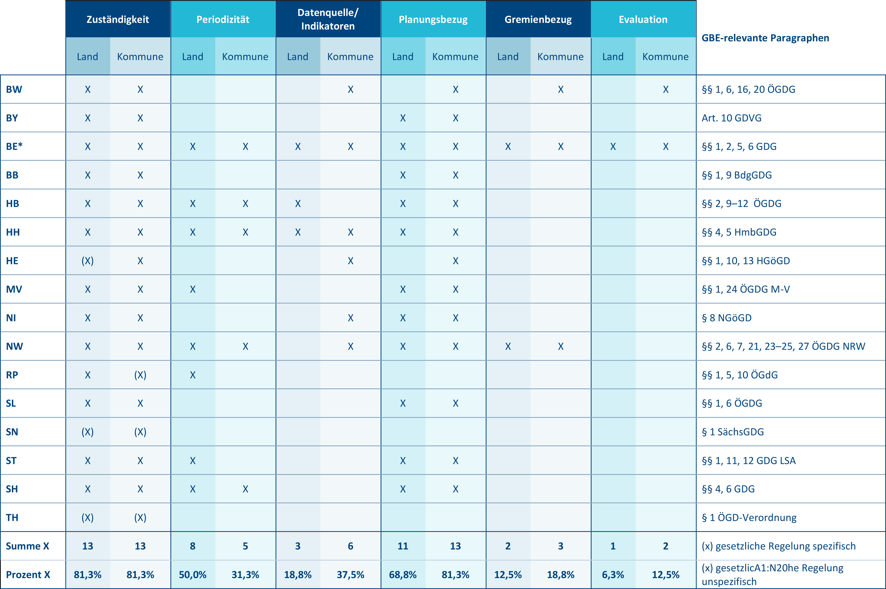

# 3. Gesundheitsberichterstattung Strukturen

 
  
 
      &#9658; Inhaltsverzeichnis Kapitel (ausklappbar) 
  

 
1. TOC
{:toc}
 

 
 
> „Ich bin in der Wissenschaft tätig, kann Ihnen die Epidemiologie hoch und runter erklären, die Zahlen richtig berechnen, perfekt darstellen und noch was Gescheites dazu schreiben. Aber nein, keine Ahnung, wer jetzt wo was zu sagen hat bei uns. Interessiert mich auch nicht so sehr ...“

<figure>
  
  <figcaption>Abbildung 5: Zusammenspiel von Bund, Land und Kommune (eigene Abbildung) © Marion Burbulla</figcaption>
</figure>

Der Öffentliche Gesundheitsdienst ist deutschlandweit auf den Ebenen von Bund, Bundesländern und Kommunen organisiert, in einigen Bundesländern kommen auf der Ebene zwischen Land und Kommune noch die Regierungspräsidien hinzu (Abbildung 5). GBE findet vor allem auf den erstgenannten drei Ebenen statt, dies jedoch in unterschiedlicher Intensität. Die Aufgaben und Strukturen des ÖGD sind weitestgehend föderal geregelt, das heißt, für die kommunale GBE sind landesgesetzliche Regelungen in Form der Gesundheitsdienstgesetze (GDG) der Länder maßgeblich (siehe Exkurs: Rechtliche Rahmenbedingungen). Für die kommunale GBE sind die übergeordneten Ebenen von Bund und Land zum Beispiel als Datenhalter, für die Datenaufbereitung und für fachliche Unterstützungsleistungen durch Landesoberbehörden, wie etwa Landesgesundheitsämter, von Bedeutung. 

## 3.1. Kommunale Ebene

Auf der Ebene der Kommunalverwaltung ist der ÖGD zum weit überwiegenden Teil in Landkreisen angesiedelt, zum Teil in kreisfreien Städten (auch als Stadtkreise/Städteregionen bezeichnet) und zu einem geringeren Teil übergreifend über mehrere Landkreise und/oder Städte. Speziell für die sinnvollerweise eng mit der GBE verbundenen Planungsprozesse ist dies bedeutsam, da verschiedene politische Ebenen und Strukturen berücksichtigt werden müssen, um mittels GBE gesundheitspolitische Entscheidungen unterstützen oder aber Gesundheitsbezüge in sonstige politische Entscheidungsprozesse im Sinne von Health in All Policies (HiAP) einspeisen zu können: 

1.  Bei überwiegend auf **Landkreis-Ebene** angesiedelten ÖGD-Strukturen sind vor allem die Landkreisverwaltung sowie die Ebene der Gemeinden und Städte des Kreises zu berücksichtigen.

2.  Sind die ÖGD-Einheiten vorrangig auf **Ebene kreisfreier Städte** angesiedelt, sind insbesondere die Stadtverwaltung sowie gegebenenfalls Ortsteilverwaltungen zu berücksichtigen.

3.  Für ÖGD-Einheiten, die **über mehrere Landkreise und/oder Stadtkreise hinweg kumuliert** sind, gilt es, neben den Verwaltungen mehrerer Landkreise und/oder kreisfreie Städte auch Gemeindeverwaltungen sowie möglicherweise Ortsteilverwaltungen zu berücksichtigen.

Für die GBE als gesundheitspolitisches Steuerungsinstrument sind diese Gebietskörperschaften relevant, da Vielzahl und Komplexität der zu berücksichtigenden politischen Entscheidungsebenen auch den für die GBE wesentlichen Prozessen mehr Komplexität verleihen. Gegenüber Städten gilt es schon in Landkreisen deutlich mehr politische Akteure und Akteurinnen zu berücksichtigen. Der höchste Komplexitätsgrad herrscht, wenn ein ÖGD für mehrere Kreise zuständig ist, da die Kommunalpolitik mehrerer Kreise bzw. Städte und dazu meist eine Vielzahl an Gemeindeverwaltungen zu berücksichtigen sind. Innerhalb der Kommunalverwaltung ist die GBE als Aufgabe des ÖGD meist im Gesundheitsamt bzw. Fachbereich Gesundheit oder ähnlichen Bereichen angesiedelt. Der ÖGD wiederum ist meist einem mehrere Ämter umfassenden Dezernat oder einer Abteilung zugeordnet, wie auch in Abbildung 6 veranschaulicht.

Den unterschiedlichen Dezernaten oder Abteilungen steht die kommunale Spitze vor, das heißt Landrätin oder Landrat bzw. Oberbürgermeisterin oder Oberbürgermeister. Gleichzeitig gilt es zu berücksichtigen, dass Landkreis oder Stadt auch politische Einheiten darstellen und kommunalpolitische Entscheidungen zum Beispiel bezüglich Ressourcen von den gewählten Vertretern und Vertreterinnen des Kreistags oder städtischen Parlaments getroffen werden. Den einzelnen Dezernaten oder Abteilungen sind meist spezifische Unterausschüsse des Kreistags oder Stadtparlaments (Stadtrates) zugeordnet, in denen fachliche Fragen erörtert werden. Auch der ÖGD und die GBE sind meist einem solchen politischen Fachausschuss zugeordnet und bringen ihre spezifischen Belange dort ein, etwa einen Gesundheitsbericht.

<figure>
  
  <figcaption>Abbildung 6: Rahmenbedingungen und zu berücksichtigende Institutionen, Dezernate und Akteursgruppen für die Realisierung einer erfolgreichen kommunalen Koordinationsaufgabe des ÖGD, dargestellt an einer kommunalen Gesundheitskonferenz in einer beispielhaften Verwaltungsstruktur (erweiterte Darstellung nach Szagun et al. 2016)© Marion Burbulla</figcaption>
</figure> 

Abhängig von der Gesetzeslage für den ÖGD im jeweiligen Bundesland sind auf kommunaler Ebene teilweise darüber hinaus noch gesundheitsspezifische Planungsgremien angesiedelt, beispielsweise in Form Kommunaler Gesundheitskonferenzen. Diese sind häufig direkt dem ÖGD zugeordnet, das heißt, ihm obliegt die Geschäftsführung. Diese Gremien sind unterschiedlich zusammengesetzt: Mitglieder sind meist lokale Stakeholder aus den Feldern Gesundheitsversorgung, Gesundheitsförderung und Prävention sowie Akteure und Akteurinnen, die mittelbar auf Gesundheit Einfluss nehmen können, wie zum Beispiel das Schulamt oder Jugendamt, mit mehr oder weniger Beteiligung von Patienten und Patientinnen sowie Bürger und Bürgerinnen. Meist stellen die Mitglieder eine Auswahl von Experten und Expertinnen dar. In der Regel ist jedoch weder die Auswahl der beteiligten Akteure und Akteurinnen noch das Gremium selbst politisch legitimiert. Daher haben diese Gremien üblicherweise eine beratende Funktion (Weiteres hierzu auch in Kapitel 2.) sowie eine eher geringe Ressourcenverantwortung. Das alles klingt nicht nur komplex, es ist auch so. Für die GBE sind die kommunalpolitischen Strukturen in vieler Hinsicht bedeutsam (Albrich et al. 2017). Will GBE „Daten für Taten“ kommunizieren, das heißt planungsrelevant sein, findet diese Planung in einem oder mehreren der oben genannten Gremien statt. Am Ende gilt es oft, Entscheidungen über Ressourcen zu beeinflussen, das heißt die dafür zuständigen Entscheidungsträger und Entscheidungsträgerinnen zu überzeugen. Die Reichweite gelingender GBE geht somit immer über das Amt hinaus und sollte daher von Anfang an mitgedacht werden. Die für die GBE zu berücksichtigenden Aspekte ergeben sich aus den verschiedenen Hierarchieebenen, den jeweiligen Ausschüssen und etwaigen Gremien von Experten und Expertinnen:

1.  **Hierarchieebenen:** Damit ein Gesundheitsbericht nicht zum zahnlosen Papiertiger mutiert, ist immer eine offizielle Verlautbarung der Kommunalbehörde erforderlich, die auch von der kommunalen Spitze genehmigt sein muss. Die für die GBE zuständige Person ist innerhalb des kommunalen ÖGD meist auf der zweiten oder dritten Hierarchieebene angesiedelt. Über der Leitung des Gesundheitsamtes liegen ein bis zwei weitere Hierarchieebenen, sodass ein Bericht nicht selten über vier Hierarchieebenen hinweg abgesegnet werden muss, bevor er nach außen gehen kann. Das kostet nicht nur Zeit, es kann auch zu Konflikten führen, sofern nicht eine gewisse Vorabstimmung zwischen den relevanten Ebenen stattgefunden hat (Näheres zu den Abstimmungsprozessen auch in [Kapitel 6]({{ site.baseurl }})). Ein Teil dieser Vorabstimmung obliegt meist der Amtsleitung, da diese einen direkten Zugang zu den übergeordneten Führungskräften hat. Günstig ist es daher, wenn zumindest im ÖGD selbst so wenige Ebenen wie möglich zwischen GBE und Amtsleitung liegen.

2.  **Kommunalpolitische Ausschüsse:** Kommunalpolitische Planungen und Ressourcenentscheidungen zu gesundheitsrelevanten Themen werden in kommunalpolitischen (Gesundheits-)Ausschüssen erörtert und vorbereitet. Die Entscheidungen werden vom Kreistag bzw. Stadtparlament getroffen. Die Ausschüsse sind von Kommunalpolitikern und Kommunalpolitikerinnen verschiedener Fraktionen besetzt, die informiert bzw. eventuell überzeugt werden müssen. Häufig ist dem ÖGD-Dezernat bzw. der ÖGD-Abteilung ein spezifischer Unterausschuss des Kreistags oder Stadtparlaments zugeordnet, zum Beispiel einem Sozialdezernat ein Ausschuss für Soziales und Gesundheit. Abhängig von der Dezernatszuordnung sind dann auch die üblichen Themen und die Expertise, die in einem solchen Ausschuss angesiedelt sind. Für die GBE gilt es, soweit wie möglich zu antizipieren, welche Themen dort auf welche Weise diskutiert werden dürften. Es kann sinnvoll sein, Vertreter und Vertreterinnen der politischen Fraktionen etwa über die Einbindung in die Gesundheitskonferenz frühzeitig in die Berichtsthematik zu involvieren, um eine konstruktive Diskussion vorzubereiten. Das Gesundheitsamt kann als eigenständige Fachabteilung/eigenständiger Fachbereich der Landrätin/dem Landrat bzw. der Oberbürgermeisterin/dem Oberbürgermeister direkt unterstellt sein, meistens ist es jedoch dem Dezernat eines/einer Beigeordneten bzw. Dezernenten/Dezernentin zugeordnet. Die häufigsten Zuordnungen des ÖGD liegen in den Dezernaten Soziales und/oder Jugend sowie Ordnung und/oder Veterinärwesen (Quelle: eigene Erhebung im Rahmen des GBE-Monitors 11–12/2019, Weiteres hierzu auch in [Kapitel 8]({{ site.baseurl }})). Die Dezernatszuordnung spielt neben der kommunalpolitischen Bedeutung auch eine Rolle dafür, wie einfach oder kompliziert es sich gestaltet, mit anderen Ämtern und Fachbereichen zu kooperieren und damit eine Integration von GBE und Planung zu realisieren (siehe [Kapitel 5]({{ site.baseurl }})). Eine direkte Unterstellung des Fachbereichs Gesundheit unterhalb der kommunalen Spitze ermöglicht es andererseits, der Gesundheitsplanung einen hohen und eigenständigen Stellenwert zu verleihen.

3.  **Experten- und Expertinnengremien zur Gesundheitsplanung:** Die spezifischen und meist nur beratenden Planungsgremien wie (Kommunale) Gesundheitskonferenzen sind häufig in mehrfacher Hinsicht relevant für die GBE: Aus ihnen kommen nicht selten Anregungen oder Aufträge für Berichtsthemen (siehe auch Kapitel 2.), und fast immer stellen sie wesentliche Adressaten und Adressatinnen der GBE dar. Auch wenn Gesundheitskonferenzen nicht demokratisch legitimiert sind, ist ihr Votum als beratendes Experten- und Expertinnengremium wesentlich dafür, ob die GBE zu Taten führt. Es gilt daher, die Diskussion in diesen Gremien vorzubereiten bzw. Mitglieder der Gremien schon vorab in den Prozess einzubeziehen (siehe auch [Kapitel 6]({{ site.baseurl }})). Essenziell für die notwendigen Abstimmungsprozesse sind häufig auch die Schnittstellen zwischen den Gremien der Experten- und Expertinnen sowie oben genannten politischen Gremien. Gute Voraussetzungen lassen sich beispielsweise gewährleisten, indem Mitglieder aller wichtigen politischen Fraktionen auch an der Gesundheitskonferenz beteiligt sind. Sofern in der Gesundheitskonferenz aktive Akteure und Akteurinnen wie beispielsweise Krankenkassen oder Ärzte- und Ärztinnenschaft direkt für ein Planungsfeld zuständig sind, können auch in der Konferenz selbst weitreichende und ressourcenrelevante Entscheidungen getroffen werden. Voraussetzung dafür ist jedoch, dass die Konferenz gut etabliert ist. Eine wichtige Rolle dafür spielt häufig auch die Offensichtlichkeit einer Bedarfslage, wie sie sich zum Beispiel aus der GBE ergeben kann.

<table>
<tbody>
<tr class="odd">
<td><h5 id="exkurs-empfehlung-zur-gbe-struktur-innerhalb-des-kommunalen-ögd"><strong>Exkurs: Empfehlung zur GBE-Struktur innerhalb des kommunalen ÖGD</strong></h5>

Grundsätzlich reichen Steuerungsaufgaben wie GBE und Planung immer über das Gesundheitsamt hinaus. Die Amtsleitung ist stets mehr oder weniger in sie eingebunden, sei es durch die entstehende Öffentlichkeit, die Diskussionen in kommunalpolitischen Gremien oder in Kommunalen Gesundheitskonferenzen. Das macht eine Unterstützung dieser Aufgaben durch die Amtsleitung einerseits zur unabdingbaren Voraussetzung, andererseits sollte die Ansiedlung dieser Aufgabenbereiche die notwendige Interaktion ermöglichen und befördern. Abhängig von der Größe des Aufgabengebiets ist daher eine Installation als Abteilung, Sachgebiet oder Stabsstelle direkt unterhalb der Leitungsebene sinnvoll. Darüber hinaus ist es hilfreich, wenn die Arbeitsfelder Planung und GBE möglichst in einer gemeinsamen Struktur integriert sind. Falls Gesundheitsförderung und Prävention prioritäre Planungsthemen darstellen, sind integrierte Arbeitseinheiten für GBE, Planung, Prävention und Gesundheitsförderung eine sinnvolle Lösung, die sich vielerorts bewährt hat.
</td>
</tr>
</tbody>
</table>

## 3.2. Landesebene 

Gesundheitsberichte auf Landesebene werden entweder von den Gesundheitsministerien (zum Beispiel in Berlin, Hamburg, Hessen oder Schleswig-Holstein) oder oberen Landesgesundheitsbehörden (Landesgesundheitsämtern) erstellt. Sie haben die Situation im Land insgesamt im Blick, berücksichtigen dabei aber häufig auch regionale Unterschiede und berichten dazu auch Daten auf Kreisebene. Für die kommunale Gesundheitsberichterstattung kann das als Datenquelle oder Vergleichsreferenz dienen. Des Weiteren unterstützt die Landesebene die kommunale Gesundheitsberichterstattung zum Beispiel durch Fortbildungen/Tagungen oder die Erstellung von [Handlungshilfen](https://www.lgl.bayern.de/gesundheit/gesundheitsberichterstattung/methoden_handlungshilfen/index.htm). Länderübergreifend bietet auch die Akademie für Öffentliches Gesundheitswesen (AÖGW) Fortbildungsveranstaltungen zur Gesundheitsberichterstattung an. 

Die Länder stimmen sich zur Gesundheitsberichterstattung in der Arbeitsgruppe Gesundheitsberichterstattung, Prävention, Rehabilitation und Sozialmedizin der Arbeitsgemeinschaft der Obersten Landesgesundheitsbehörden (GPRS AOLG) ab. Auf dieser Ebene wurde 2003 auch ein gemeinsamer Gesundheitsindikatorensatz der Länder vereinbart, um zumindest für einige Gesundheitsindikatoren Ländervergleiche vornehmen zu können. Das Robert Koch-Institut (RKI), das Statistische Bundesamt und die Akademie für Öffentliches Gesundheitswesen (AÖGW) sind ständige Gäste dieser Arbeitsgruppe. Ein regelmäßiger Bund-Länder-Workshop zur Gesundheitsberichterstattung, den das Robert Koch-Institut in Abstimmung mit den Ländern veranstaltet, stellt auch die vertikale Verständigung zwischen Bund und Ländern sicher. 

## 3.3. Bundesebene

Auf der Ebene des Bundes ist das Robert Koch-Institut zusammen mit dem Statistischen Bundesamt für die Gesundheitsberichterstattung zuständig. Das RKI verantwortet die inhaltliche und konzeptionelle Ausgestaltung und Weiterentwicklung des Berichtswesens sowie die GBE-Publikationen auf Bundesebene. Das Statistische Bundesamt stellt die wesentlichen Datenquellen im [Informationssystem der Gesundheitsberichterstattung des Bundes (IS-GBE)](https://www.gbe-bund.de/) bereit (Ziese 2000). Im IS-GBE stehen Informationen und Daten aus über 100 Datenquellen zur Verfügung. Viele Tabellen sind entsprechend der eigenen Fragestellung modifizierbar, auch Grafiken können erstellt werden. Das Angebot wird kontinuierlich ergänzt und aktualisiert. Im Rahmen des Gesundheitsmonitorings führt das RKI in regelmäßigen Abständen bundesweite repräsentative Befragungs- und Untersuchungssurveys durch (siehe auch [Kapitel 4]({{ site.baseurl }})). 

Akteure und Akteurinnen im Gesundheitswesen, der Gesundheitswissenschaft sowie Datenhalter und Datenhalterinnen und internationale Experten und Expertinnen werden über die Kommission Gesundheitsberichterstattung und Gesundheitsmonitoring am Robert Koch-Institut in die Arbeit der Gesundheitsberichterstattung des Bundes einbezogen. Die Berichterstatter und Berichterstatterinnen des RKI arbeiten in zahlreichen gesundheitspolitischen und wissenschaftlichen Gremien und Prozessen auf nationaler sowie internationaler Ebene mit, sodass auch auf diesem Wege ein ständiger Austausch mit Politik, Forschung und Praxis sichergestellt wird (Lampert et al. 2010).

<table>
<tbody>
<tr class="odd">
<td><h5 id="exkurs-rechtliche-rahmenbedingungen"><strong>Exkurs: Rechtliche Rahmenbedingungen</strong></h5>

Die jeweilige Ausgestaltung sowie der vorgeschriebene Grad an Verbindlichkeit und Rahmen, in dem Gesundheitsberichterstattung erfolgen soll, variieren zum Teil erheblich. Dies zeigt sich insbesondere, wenn man die Gesetzestexte vergleichend gegenüberstellt (siehe Tabelle 2): In manchen Bundesländern, etwa Nordrhein-Westfalen, Baden-Württemberg oder Berlin, gibt es ausführlichere Vorgaben für die Gesundheitsberichterstattung sowie auch Verknüpfungen zu Kommunalen Gesundheitskonferenzen (KGK) oder kommunalen Gesundheitszielen. In einzelnen Bundesländern existiert hingegen lediglich eine Rahmenverordnung zur Beobachtung und Bewertung des allgemeinen Gesundheitszustandes der Bevölkerung, ohne jedwede Konkretisierung oder Spezifizierung hinsichtlich gesetzlicher Zuständigkeit, Periodizität des Berichtswesens oder inhaltlichen Vorgaben zu relevanten Datenquellen oder Indikatoren (Weiteres hierzu auch in [Kapitel 4]({{ site.baseurl }})). Betrachtet man zudem die gesetzlichen Vorgaben für die Landesebene und kommunale Ebene separat, zeigt sich eine noch deutlichere Heterogenität in der Ausgestaltung und den damit verbundenen Freiheitsgraden. Knapp die Hälfte aller Gesundheitsdienstgesetze (GDG) beinhaltet Vorgaben zur Periodizität bzw. dem Berichtsturnus auf Landesebene, auf kommunaler Ebene bzw. Bezirksebene findet sich das vor allem in den Stadtstaaten. Inhaltliche Vorgaben wie Regelungen zur Datenweitergabe, aufzunehmende Themenfelder oder auch Angaben zur gewünschten Aggregationsebene sind sowohl auf Landes- als auch auf kommunaler Ebene in knapp der Hälfte aller Gesetzestexte enthalten. Auf Landes- sowie auf kommunaler Ebene attestiert die weit überwiegende Mehrheit aller GDG der Gesundheitsberichterstattung eine gesundheitspolitische Steuerungsfunktion, wie in der nachfolgenden Tabelle 2 ersichtlich.

</td>
</tr>
</tbody>
</table>

<figure>
<figcaption>Tabelle 2: Verankerung von Gesundheitsberichterstattung in den Gesundheitsdienstgesetzen der Länder (eigene Analyse, Stand 02/2020), publiziert in: (Rosenkötter et al. 2020)) © Marion Burbulla</figcaption>

</figure>

## 3.4. Weiterführende Informationen

GBE auf kommunaler und Landesebene 

* Jacob, R; Michels, H (2000): Regionale und kommunale Gesundheitsberichterstattung. In: Bundesgesundheitsbl. 43 (8), S. 615–623. <a href="https://www.doi.org/10.1007/s001030070021">DOI: 10.1007/s001030070021</a>.

* Rosenkötter, N; Borrmann, B; Arnold, L; Böhm, A (2020): Gesundheitsberichterstattung in Ländern und Kommunen: Public Health an der Basis. In: Bundesgesundheitsbl. 63, S. 1067–1075. <a href="https://www.doi.org/10.1007/s00103-020-03190-z">DOI: 10.1007/s00103-020-03190-z</a>. 

* Stockmann, S; Kuhn, J; Zirngibl, A; Mansmann, U (2008): Kommunale Gesundheitsberichterstattung in Deutschland: eine empirische Erhebung. In: Das Gesundheitswesen 70 (11), S. 679–683. <a href="https://www.doi.org/10.1055/s-0028-1100402">DOI: 10.1055/s-0028-1100402</a>. 

GBE auf Bundesebene

* Kurth, B-M; Ziese, T; Tiemann, F (2005): Gesundheitsmonitoring auf Bundesebene. In: Bundesgesundheitsbl. 48 (3), S. 261–272. <a href="https://www.doi.org/10.1007/s00103-004-1001-6">DOI: 10.1007/s00103-004-1001-6</a>. 

* Kurth, B-M; Lange, C; Kamtsiuris, P; Hölling, H (2009): Gesundheitsmonitoring am Robert Koch-Institut. Sachstand und Perspektiven. In: Bundesgesundheitsbl. 52 (5), S. 557–570. <a href="https://www.doi.org/10.1007/s00103-009-0843-3">DOI: 10.1007/s00103-009-0843-3</a>. 

Rechtliche Hintergründe der GBE

* Kuhn, J (2007): Die historische Entwicklung der kommunalen Gesundheitsberichterstattung. Eine Forschungslücke. In: Das Gesundheitswesen 69 (10), S. 507–513. <a href="https://www.doi.org/10.1055/s-2007-992160">DOI: 10.1055/s-2007-992160</a>.

* Rosenkötter, N; Borrmann, B; Arnold, L; Böhm, A (2020): Gesundheitsberichterstattung in Ländern und Kommunen: Public Health an der Basis. In: Bundesgesundheitsbl. 63, S. 1067–1075. <a href="https://www.doi.org/10.1007/s00103-020-03190-z">DOI: 10.1007/s00103-020-03190-z</a>. 

## 3.5. Literaturverzeichnis Kapitel 3. – GBE-Strukturen

* Albrich, C; Brandeis, B; Erb, J; Hellmann, V; Wallus, L; Firsching, M et al. (2017): Handlungsempfehlung für den Aufbau einer Gesundheitsplanung im Öffentlichen Gesundheitsdienst. Ergebnisse eines Pilotvorhabens in Baden-Württemberg. Hg. v. Ministerium für Soziales und Integration Baden-Württemberg. Landesgesundheitsamt Baden-Württemberg. Stuttgart.

* Lampert, T; Horch, K; List, S (2010): Gesundheitsberichterstattung des Bundes: Ziele, Aufgaben und Nutzungsmöglichkeiten. Berlin (GBE Kompakt, 1). Online verfügbar unter <a href="https://www.rki.de/gbe-kompakt">www.rki.de/gbe-kompakt</a>, zuletzt geprüft am 15.08.2023.

* Rosenkötter, N; Borrmann, B; Arnold, L; Böhm, A (2020): Gesundheitsberichterstattung in Ländern und Kommunen: Public Health an der Basis. In: Bundesgesundheitsbl. (Bundesgesundheitsblatt – Gesundheitsforschung – Gesundheitsschutz) 63, S. 1067–1075. <a href="https://www.doi.org/10.1007/s00103-020-03190-z">DOI: 10.1007/s00103-020-03190-z</a>.

* Szagun, B; Kuhn, J; Starke, D (2016): Kommunale Gesundheitsförderungspolitik und das Präventionsgesetz. In: Präv Gesundheitsf 11 (4), S. 265–270. <a href="https://www.doi.org/10.1007/s11553-016-0563-0">DOI: 10.1007/s11553-016-0563-0</a>.

* Ziese, T (2000): Beginn der Routinephase. In: Bundesgesundheitsbl. (Bundesgesundheitsblatt – Gesundheitsforschung – Gesundheitsschutz) 43 (8), S. 600–604. <a href="https://www.doi.org/10.1007/s001030070018">DOI: 10.1007/s001030070018</a>.
