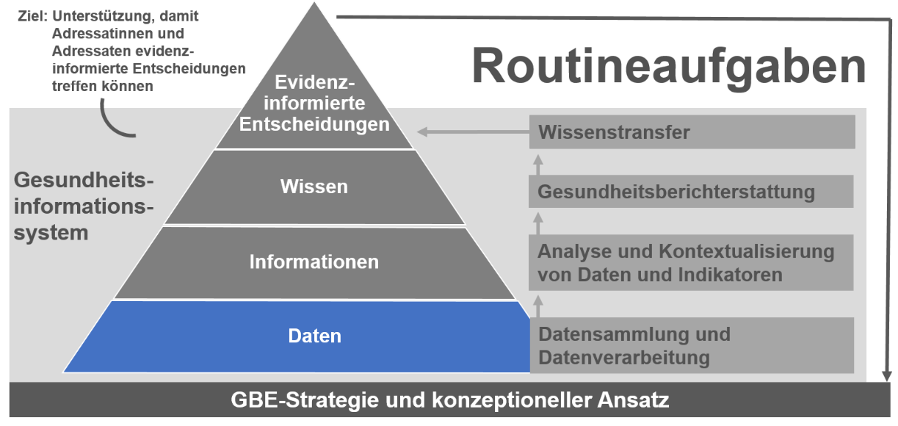
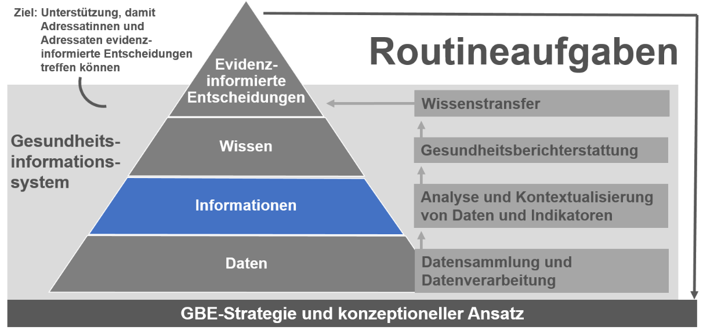

# {{page.title}}

 
  
 
      &#9658; Inhaltsverzeichnis Kapitel (ausklappbar) 
  

 
1. TOC
{:toc}
 

 
 
 
> Ich hab' echt nie verstanden, was an GBE schwer sein soll.  
> Ein paar Daten zusammenrühren, schön bunt machen, ein bisschen texten
> und raus damit. Hab ja auch noch andere Aufgaben ...“

<table>
<tbody>
<tr class="odd">
<td><blockquote>

<strong>Stellenausschreibung</strong> <strong>einer GBE-Stelle</strong>

<strong>Purzelbaum oder Rolle rückwärts? Für Sie kein Entweder-oder: Sie machen einfach beides, und zwar gleichzeitig!</strong>

Erkennen Sie sich wieder? Dann sind Sie die richtige Person, denn das Gesundheitsamt „Im siebten Himmel“ sucht für seine Gesundheitsberichterstattung einen Menschen, der Spaß daran hat, Gegensätze zu leben:

</blockquote>
<ul>
<li>
Sie lieben das einsame Geschäft der Datenauswertung; gleichzeitig sind Sie integrativ, kommunikativ und gehen gern auf andere Menschen zu.
</li>
<li>
Sie sind leidenschaftliche Expertin/leidenschaftlicher Experte Ihres eigenen Fachgebietes; zugleich lassen Sie sich gern auf interdisziplinäres Arbeiten ein.
</li>
<li>
Sie arbeiten nach wissenschaftlichen Kriterien, dennoch finden Sie eine angemessene Sprache für unterschiedlichste Adressaten und Adressatinnen.
</li>
<li>
Sie reagieren schnell; parallel haben Sie einen langen Atem bei Projekten, die auf Jahre angelegt sind.
</li>
<li>
Sie arbeiten strukturiert, aber trotzdem kreativ.
</li>
<li>
Sie haben keine Scheu vor Zahlen und großen Datenmengen und zudem Verständnis dafür, dass nicht alle Ihre Liebe zu Zeitreihen teilen.
</li>
<li>
Sie arbeiten selbstständig und zielorientiert, Ihre Partner und Partnerinnen verlieren Sie dennoch nicht aus dem Blick.
</li>
<li>
Obwohl Sie in einer hierarchischen Struktur landen, leben Sie partnerschaftliches, motivierendes Arbeiten.
</li>
<li>
Ihr Blick ist auf das große Ganze gerichtet, aber die Details vergessen Sie nicht.
</li>
</ul>
<blockquote>

<strong>Wenn Sie sich durch diese Widersprüche herausgefordert fühlen, dann bewerben Sie sich noch heute „Im siebten Himmel“.</strong>

</blockquote></td>
</tr>
</tbody>
</table>

Diese Stellenbeschreibung ist natürlich bewusst überspitzt formuliert.
Dennoch enthält sie viele Körnchen Wahrheit, denn als
Gesundheitsberichterstatter und Gesundheitsberichterstatterin kommt man
sich tatsächlich manchmal vor wie die berühmte eierlegende Wollmilchsau.
GBE erfordert viele Fähigkeiten, die oftmals im Widerspruch zueinander
stehen und auch im Studium nicht immer vermittelt werden (können). Um
nicht zwischen Widersprüchen und Ansprüchen zerrieben zu werden, gibt es
„Handwerkszeug“ für eine gute GBE. Das folgende Kapitel soll hier einen
ersten Einblick geben.

## Datengrundlagen der Gesundheitsberichterstattung

Abbildung 7 Datenbasis der GBE in der Informationspyramide (erweiterte
Darstellung nach Verschuuren, van Oers 2019)

Gesundheitsberichterstattung arbeitet zumeist mit sogenannten
**Sekundärdaten**. Als Sekundärdaten bezeichnet man Daten, die in
anderen Zusammenhängen entstanden bzw. die für andere Zwecke erhoben
worden sind. Beispiele sind amtliche Statistiken wie
Bevölkerungsstatistiken, die Todesursachenstatistik oder die
obligatorischen Statistiken der Gesetzlichen Krankenversicherung (KV 45,
KJ 1, KM 1, weitere Informationen unter:
[Link](https://www.gkv-spitzenverband.de/service/zahlen_und_grafiken/gkv_kennzahlen/gkv_kennzahlen.jsp))
und der Krankenhäuser. Zu den für die GBE nutzbaren Sekundärdaten zählen
auch Registerdaten (zum Beispiel Krebsregister, Herzinfarktregister)
sowie Routinedaten und prozessgenerierte Daten. Routinedaten bzw.
prozessgenerierte Daten sind Informationen, die Behörden, Organisationen
und Unternehmen im Zuge ihrer Aktivitäten erheben. Bekannte Beispiele
sind die Daten aus den Schuleingangsuntersuchungen der Gesundheitsämter
oder die gemäß dem Infektionsschutzgesetz (IfSG) erhobenen
Informationen. Auch die Daten der Sozialversicherungen und der
Kassenärztlichen Vereinigungen können für die
Gesundheitsberichterstattung von Bedeutung sein. Weitere Datenquellen
für die Gesundheitsberichterstattung sind wissenschaftliche Studien,
beispielsweise die Studie zur Gesundheit von Kindern und Jugendlichen in
Deutschland (KiGGS), die häufig als sogenannte Public-Use-Files zur
Verfügung stehen (Weiteres hierzu auch in [Kapitel 6]({{ site.baseurl }})). Public-Use-Files
sind Daten, die von verschiedenen Instituten der Forschungsinfrastruktur
für öffentliche und/oder wissenschaftliche Zwecke zur Verfügung gestellt
werden. Sie können für eigene statistische Auswertungen genutzt werden,
um zu neuen, für den Berichtsgegenstand relevanten Erkenntnissen zu
gelangen.

Für die Nutzung von Sekundärdaten sprechen in erster Linie
forschungsökonomische Überlegungen: Sekundärdaten müssen nicht erst
mühsam erhoben werden, sondern liegen schon aufbereitet in auswertbarer
Form vor. Idealerweise wurden sie standardisiert erfasst, man kann also
in der Regel eine gewisse Datenqualität unterstellen. Dies gilt
insbesondere für Survey-Daten.

Eine wichtige Datenbank, in der viele Datenquellen für Deutschland und
die Bundesländer zu finden sind, ist die **Datenbank der
Bundesgesundheitsberichterstattung**, online unter
[www.gbe-bund.de](https://www.gbe-bund.de/gbe/).
Dort sind einzelne Sachverhalte über Suchbegriffe wie in einer
Suchmaschine recherchierbar und die Tabellen oft nach den eigenen
Bedürfnissen veränderbar. Allerdings sind dort bisher keine Daten auf
Kreisebene abrufbar. Diese muss man zum Beispiel in den Sammlungen von
Gesundheitsindikatoren der Länder suchen, auf der Webseite
[www.regionalstatistik.de](https://www.regionalstatistik.de/), betrieben
von den statistischen Landesämtern, oder in den jeweiligen
Originalquellen. Gesundheitsberichterstattung ist immer auch ein Suchen
und Finden.

Eine weitere wichtige Datenbank ist die Datenbank **INKAR** des
Bundesinstituts für Bau-, Stadt- und Raumforschung, online unter
[www.inkar.de](https://www.inkar.de/).
Hier sind bis auf Kreisebene viele auch für die
Gesundheitsberichterstattung relevante Daten abrufbar, vor allem zu
sozialen, ökonomischen oder siedlungsstrukturellen Merkmalen. Es gibt
auch einige Gesundheitsindikatoren, unter anderem sind hier Daten zur
Lebenserwartung auf Kreisebene zu finden, die es in der amtlichen
Statistik sonst nicht gibt.

### Datenquellen der Gesundheitsberichterstattung

Einige wichtige Datenquellen der Gesundheitsberichterstattung werden im
Folgenden kurz vorgestellt:

Die **Todesursachenstatistik** ist eine der häufig genutzten
Datenquellen der Gesundheitsberichterstattung. Sie gehört zur „amtlichen
Statistik“, also zu den durch Gesetz geregelten und den statistischen
Ämtern übertragenen Statistiken. Gesetzliche Grundlage der
Todesursachenstatistik in Deutschland ist das Gesetz über die Statistik
der Bevölkerungsbewegung und die Fortschreibung des Bevölkerungsstandes
(Bevölkerungsstatistikgesetz). Die Todesursachenstatistik wird in
Deutschland seit mehr als 100 Jahren erhoben und liegt nach Vorgaben der
Weltgesundheitsorganisation in ähnlicher Form auch international vor. In
der Todesursachenstatistik wird nach der Internationalen statistischen
Klassifikation der Krankheiten (ICD) codiert
([www.dimdi.de](https://www.dimdi.de/dynamic/de/klassifikationen/icd/)).
Dabei wird in Deutschland derzeit noch eine monokausale
Todesursachenstatistik geführt: In der Statistik wird das „Grundleiden“
codiert, also die Krankheit, die medizinisch ursächlich für den Tod ist.
Das ist häufig nicht der unmittelbar den Tod auslösende Befund.
Grundlage der Todesursachenstatistik sind die ärztlichen Eintragungen
auf der Todesbescheinigung. Sie werden von den Standesämtern über die
Gesundheitsämter an die Statistischen Landesämter übermittelt. Es ist
vorgesehen, auch in Deutschland eine multikausale Todesursachenstatistik
einzuführen, in der alle Eintragungen auf der Todesbescheinigung zur
Kausalkette der Todesursachen genutzt werden. Darüber hinaus gibt es das
Bestreben, die Validität der Todesursachenstatistik weiter zu verbessern
sowie die Latenz zur Bereitstellung der Daten zu verkürzen (Eckert,
Vogel 2018). Die Daten lassen sich nach Alter, Geschlecht,
Staatsangehörigkeit und Wohnort differenzieren. Sie liegen auf
Kreisebene und zum Teil auch noch kleinräumiger vor. Eine für die
Gesundheitsberichterstattung gravierende Einschränkung der Aussagekraft
der Todesursachenstatistik besteht darin, dass sie keine Angaben zum
Sozialstatus der Verstorbenen enthält.

Auch die **Krankenhausstatistik** ist eine amtliche Statistik.
Rechtliche Grundlage ist hier die Krankenhausstatistik-Verordnung. Die
Diagnosedaten sind wie bei der Todesursachenstatistik ICD-codiert und
dokumentieren die Hauptbehandlungsdiagnose. Sie sind ebenfalls nach
Alter und Geschlecht sowie nach Wohnort und Behandlungsort
differenzierbar. Auch diese Daten liegen auf Kreisebene vor. In der
Krankenhausdiagnosestatistik werden Behandlungsdiagnosen geführt. Das
bedeutet, dass Mehrfachbehandlungen einer Diagnose eines Patienten/einer
Patientin mehrfach innerhalb eines Kalenderjahres gezählt werden können.
Darüber hinaus liefert die Krankenhausstatistik wichtige Strukturdaten
über die Krankenhäuser, zum Beispiel über Bettenzahlen, Liegedauer oder
das Personal der Krankenhäuser, dies jedoch meist nicht bis auf die
Kreisebene herab. Neben der amtlichen Krankenhausstatistik gibt es auch
Krankenhausdaten aus der DRG-Statistik (*DRG*=Diagnosis Related Groups),
der fallpauschalenbezogenen Krankenhausstatistik aus dem
Abrechnungssystem der Krankenhäuser. Allerdings sind die DRG-Daten auf
kommunaler Ebene nicht routinemäßig über die Statistischen Landesämter
verfügbar.

Bei der Berichterstattung zur Kindergesundheit sind die Daten der
**Schuleingangsuntersuchungen** eine wichtige Datenquelle. Sie werden
von den Gesundheitsämtern selbst erhoben. Allerdings liegen sie in
länderspezifischer Form vor, das heißt, es gibt kaum zwischen den
Bundesländern vergleichbare Daten aus den Schuleingangsuntersuchungen.
Der Merkmalskatalog umfasst in der Regel Angaben zur Seh- und
Hörfähigkeit der Kinder, zu den motorischen Fähigkeiten, ihrer
geistigen Entwicklung, der Sprachfähigkeit sowie zu Gewicht und Größe.
Auch der Impfstatus der Kinder wird in den Schuleingangsuntersuchungen
dokumentiert. In manchen Bundesländern werden zusätzlich
sozialstrukturelle Merkmale sowie Angaben zur Lebenssituation und zum
Migrationshintergrund erhoben. Im Idealfall lassen sich anhand dieser
Daten Assoziationen zu Gesundheit und sozialer Lage (der Eltern) schon
im Kindesalter zeigen. Die Daten der Schuleingangsuntersuchungen
zeichnen sich dadurch aus, dass sie für eine wichtige biografische Phase
der Kindheit optimalerweise einen vollständigen Jahrgang erfassen.
Außerdem sind es Daten, die das Gesundheitsamt selbst erhebt, deren
Aussagekraft es also auch gut beurteilen kann. Es gilt jedoch zu
berücksichtigen, dass es sich hierbei um Screening-Daten handelt, die
den aktuellen Gesundheitszustand nur ausschnittsweise beschreiben
können. Der psychische Gesundheitszustand wird zum Beispiel allenfalls
in der ärztlichen Anamnese erfasst, jedoch nicht systematisch erhoben.
Schuleingangsuntersuchungen bieten die Möglichkeit, für spezifische
Fragestellungen zusätzliche (kurze) Frageinstrumente zu integrieren.
Darüber hinaus haben sie ein gutes Potenzial für planungsrelevante
Analysen unterhalb der Kreisebene und werden vielerorts zum Beispiel im
Rahmen einer integrierten Gesundheits- und Sozialberichterstattung dafür
genutzt. Kleinräumige Auswertungen dürfen jedoch nur unter der
Voraussetzung erfolgen, dass der Datenschutz der personenbezogenen Daten
gewährleistet bleibt und die Kalibrierung der Untersucher und
Untersucherinnen es ermöglicht, Untersucher- und Untersucherinneneffekte
(das heißt, Muster und Effekte in den Daten, die auf unterschiedliche
Handhabungen der Untersucher und Untersucherinnen zurückzuführen sind
und somit ein Datenartefakt darstellen) methodisch sauber von räumlichen
Effekten abzugrenzen.

Eine weitere wichtige Datenquelle für die Gesundheitsberichterstattung,
über die die Gesundheitsämter selbst verfügen, sind die **Daten aus dem
Meldewesen über Infektionskrankheiten**. Das Infektionsschutzgesetz
sieht vor, dass für bestimmte Infektionskrankheiten der Verdacht, der
Laborbefund oder die Erkrankung meldepflichtig sind. Daran knüpfen sich
in der Arbeit des Gesundheitsamtes weitreichende Folgen an, bei einem
Masernausbruch in einer Kita beispielsweise Umgebungsuntersuchungen oder
bei Infektionen in Lebensmittelbetrieben vielleicht ein
Betätigungsverbot für die betroffenen Beschäftigten. Zudem eignen sich
die Daten für manche Themen der Gesundheitsberichterstattung. So ist
beispielsweise die Entwicklung der Masernzahlen, zusammen mit der
Entwicklung der Masernimpfquoten (aus den Schuleingangsuntersuchungen),
auch für die breitere Öffentlichkeit von Interesse. Die Daten des
Meldewesens unterliegen natürlich strengen Datenschutzanforderungen, es
sollen ja nicht einzelne erkrankte Menschen identifiziert und dann
womöglich stigmatisiert werden. Zudem ist zu bedenken, dass die Daten
auf Meldungen vor allem von Ärztinnen und Ärzten sowie Laboren beruhen.
Es sind keine Daten aus epidemiologischen Erhebungen, sie sind mit
vielfältigen Selektionseffekten behaftet. Bei den Masern weiß man
beispielsweise, dass die Meldedaten das reale Infektionsgeschehen
deutlich unterschätzen (Takla et al. 2014).

Eine weitere bedeutende Datengrundlage der Gesundheitsberichterstattung,
besonders im Hinblick auf Gesundheitsverhalten und gesundheitliche
Ungleichheit, sind die **Daten des Gesundheitsmonitorings am Robert
Koch-Institut**, die sogenannten bundesweiten **Gesundheitssurveys**.
Die Monitoringstudien KiGGS (Studie zur Gesundheit von Kindern und
Jugendlichen in Deutschland), DEGS (Studie zur Gesundheit Erwachsener in
Deutschland) und GEDA (Gesundheit in Deutschland aktuell) – um nur ein
paar exemplarisch zu benennen – werden in regelmäßigen Abständen
durchgeführt und decken ein großes Themenspektrum ab (Kurth et al.
2009). Neben Prävalenzschätzungen sind auch Analysen zu Zusammenhängen
zwischen Gesundheitsoutcomes und zahlreichen Determinanten möglich. Mehr
Informationen zu den Gesundheitssurveys findet sich auch auf der Website
des Robert Koch-Instituts
([Link](https://www.rki.de/DE/Content/Gesundheitsmonitoring/Studien/Studien_node.html;jsessionid=D62F5D309E7332B1531A96291681D825.internet052)).
Zunehmend wird in den Gesundheitssurveys die Diversität der Gesellschaft
besser abgebildet, beispielsweise durch die verstärkte Einbindung von
Älteren und Hochaltrigen (RKI 2019) oder Menschen mit
Migrationshintergrund (Santos-Hövener et al. 2019).

### Datenerhebungen

Für viele Berichtsthemen sind Sekundärdaten vollkommen ausreichend,
manchmal jedoch decken sie nicht alle Aspekte eines Berichtsthemas ab.
In solchen Fällen muss der/die Berichterstattende die fehlenden
Informationen selbst erheben oder versuchen, neue Datenquellen zu
akquirieren.

Bei eigenen Erhebungen nutzt die Gesundheitsberichterstattung das
methodische Instrumentarium der **empirischen Sozialforschung**. In
aller Regel ist dies die standardisierte (quantitative) Befragung,
andere Methoden der Datengewinnung wie die Beobachtung oder das
Interpretieren von Texten (Inhaltsanalyse) sind ausgesprochen selten.
Einen allgemein verständlichen Überblick über die Methoden der
empirischen Sozialforschung gibt Diekmann (2014). In der empirischen
Sozialforschung lassen sich zwei methodologisch unterschiedliche
Positionen unterscheiden: zum einen der quantitative Forschungsansatz,
der sich an naturwissenschaftlicher Methodologie orientiert, zum anderen
der qualitative Ansatz, dessen Wurzeln in der Ethnologie und in der
frühen stadtsoziologischen Forschung liegen. In der
Gesundheitsberichterstattung als auch in der Gesundheitsforschung
allgemein dominiert der quantitative Ansatz. Studien, in denen
qualitative Methoden eine Rolle spielen, sind die Ausnahme.

Seit einiger Zeit wird in der Gesundheitsberichterstattung verstärkt
über die Nutzung **qualitativer Verfahren** diskutiert. Daher seien an
dieser Stelle kurz die wesentlichen Unterschiede zwischen den beiden
Forschungsansätzen beschrieben. Kennzeichnend für den quantitativen
Ansatz ist die strikte Trennung zwischen Forschenden und Beforschten,
der Einsatz standardisierter Erhebungsinstrumente in kontrollierten
Erhebungssituationen sowie das Erreichen möglichst großer Fallzahlen, um
innerhalb vertretbarer Fehlergrenzen durch statistische Auswertungen
allgemeingültige Aussagen zu gewinnen. Um begründen zu können, warum man
was erhebt, setzt dieser Ansatz allerdings ein Mindestmaß an Vorwissen
über den Untersuchungsgegenstand voraus. Demgegenüber versucht der
qualitative Ansatz ausdrücklich, die subjektiven Sichtweisen der
Beforschten kennenzulernen und daraus ableitbare Handlungen zu
verstehen. Dies erfordert eine offene Herangehensweise mit möglichst
wenig standardisierten Methoden wie Beobachtungen oder offenen
Interviews. Das dabei gewonnene umfangreiche Datenmaterial – Videos,
Beobachtungsprotokolle oder transkribierte Interviewtexte – wird
anschließend aufwendig analysiert. Von daher basieren qualitative
Studien höchstens auf einigen Dutzend Fällen. Wegen des offenen,
teilweise intuitiven Vorgehens und der geringen Fallzahlen wird die
Validität der Ergebnisse qualitativer Studien jedoch häufig
angezweifelt.

Die jeweiligen Stärken beider Ansätze lassen sich innerhalb von
**Mixed-Methods-Designs** nutzen. Aufgrund ihrer Offenheit eignen sich
qualitative Verfahren insbesondere zur Gewinnung neuer Erkenntnisse und
zur Generierung von Hypothesen, die anschließend mithilfe quantitativer
Verfahren geprüft werden können. Unter anderem wegen des damit
verbundenen Aufwands ist dies im Forschungskontext häufiger als in der
GBE gefragt.

### Indikatoren in der Gesundheitsberichterstattung

> „The wisdom, justice, and perceived legitimacy of public decisions are
> crucially affected by the **quality of the information** on which they
> are based” (Institute of Medicine (U.S.) 1988).

Daten sprechen nicht für sich allein und müssen entsprechend
transformiert sowie aufbereitet werden, um als Planungsgrundlage für
(gesundheits-)politische Entscheidungen zu dienen. In der GBE greift man
hierzu vielfach auf (Gesundheits-)Indikatoren zurück. Möchte man
beispielsweise die Sterblichkeit infolge von Herz-Kreislauf-Erkrankungen
in einer bestimmten Region auswerten, könnte sich hierfür die Anzahl der
Herz-Kreislauf-Todesfälle je 100.000 Einwohner in einem bestimmten
Zeitraum als Indikator eignen. Indikatoren sind Maßzahlen, die durch die
Angabe einer oder mehrerer Bezugseinheiten gekennzeichnet sind und deren
Berechnung standardisiert ist, um Vergleiche zu ermöglichen. Häufig
werden Indikatoren nach verschiedenen bevölkerungsbezogenen, räumlichen
oder auch zeitlichen Bezugseinheiten variiert (Hamburger Projektgruppe
Gesundheitsberichterstattung 1998). Diese Kontextualisierung von Daten
und Indikatoren stellt somit die Informationsbasis der
Gesundheitsberichterstattung dar, wie in der nachfolgenden Abbildung
veranschaulicht:

Abbildung 8 Informationen als Routineaufgaben der GBE anhand der
Informationspyramide (erweiterte Darstellung nach Verschuuren, van Oers
2019)

Oft dienen Indikatoren als Marker für die gesundheitliche Lage,
Ressourcen und Leistungen im Gesundheitswesen und ermöglichen auf diese
Weise ein kontinuierliches Monitoring von Programmen, Zielen und
Maßnahmen (AOLG 2003). Dabei liefern Indikatoren ein Maximum an
Informationsverdichtung zu einem bestimmten Interessensgebiet und
umfassen häufig auch Interessensbereiche für (politische) Maßnahmen oder
dienen der (politischen) Zielsetzung. Ein Beispiel: Ein kommunales
Gesundheitsziel zielt darauf ab, den prozentualen Anteil jugendlicher
Raucherinnen und Raucher auf weniger als 20 % zu reduzieren. Indikatoren
sollten dies auf möglichst effiziente Weise darstellen, das heißt eine
möglichst einfache Darstellung liefern (Kramers 2005, zit. nach
Verschuuren et al. 2014). Traditionell wird hierzu auf numerische
Darstellungsformen zurückgegriffen, in den letzten Jahren finden aber
auch zunehmend visuelle Aufbereitungen Anklang.

Ziel und Zweck einer indikatorengestützten Gesundheitsberichterstattung
ist die kompakte Darstellung (gesundheits-)relevanter Themen um
Informationsdefiziten entgegenzuwirken, Problem- sowie Optionsfelder
aufzuzeigen und prioritäre gesundheitspolitische Entscheidungshilfen zu
unterstützen. Im Idealfall kann die indikatorengestützte
Berichterstattung somit eine evidenzinformierte Entscheidungsfindung
unterstützen.

Infobox 1 Zielsetzung und Verwendungszweck von Gesundheitsindikatoren
(AOLG 2003, S. 13)

<table>
<tbody>
<tr class="odd">
<td>
<strong>Gesundheitsindikatoren …</strong>

<ul>
<li>
sind ein wichtiges Werkzeug zur Formulierung und Umsetzung von <strong>Gesundheitspolitik</strong>.
</li>
<li>
ermöglichen <strong>Fortschrittskontrolle</strong>, zum Beispiel durch Monitoring und Evaluation der gesundheitlichen Lage.
</li>
<li>
stellen <strong>Maßstäbe</strong> dar und bieten so <strong>Vergleichsmöglichkeiten</strong> für Länder und Kommunen (Benchmarking).
</li>
<li>
verbessern die Möglichkeit zur <strong>Kommunikation</strong> und <strong>Koordinierung</strong>.
</li>
<li>
können wichtige Informationen über <strong>gesundheitspolitische Prioritäten</strong> geben.
</li>
</ul></td>
</tr>
</tbody>
</table>

Als Grundlage für Gesundheitsrahmenberichte der Länder wurde bereits vor
dem Aufbau einer nationalen Gesundheitsberichterstattung im Jahr 1991
die erste Version eines **Indikatorensatzes für die
Gesundheitsberichterstattung der Länder** mit 190 Indikatoren
veröffentlicht. Fünf Jahre später wurde nach ersten Erfahrungen eine
überarbeitete und gekürzte Version verabschiedet. Die Veröffentlichung
der bis heute gültigen dritten Version des Indikatorensatzes erfolgte
2003 auf Beschluss der Arbeitsgemeinschaft der Obersten
Landesgesundheitsbehörden (AOLG 2003) und im Auftrag der
Gesundheitsministerkonferenzen (Bardehle et al. 2004). Die insgesamt 297
Indikatoren des Indikatorensatzes verteilen sich auf diese Themenfelder:
Bevölkerung, wirtschaftliche und soziale Lage; Morbidität und
Mortalität; Gesundheitsverhalten; Gesundheitsrisiken aus der
natürlichen und technischen Umwelt; Einrichtungen des
Gesundheitswesens; Inanspruchnahme von Leistungen der
Gesundheitsversorgung; Beschäftigte und Ausbildung; Ausgaben und Kosten
im Gesundheitswesen. Zu jedem Indikator gibt es eine kurze
Metadatenbeschreibung, die Auskunft gibt zum Beispiel über Datenquellen,
Periodizität, Aussagekraft. Bis zu 80 Indikatoren (je nach Land) liegen
auch auf Kreisebene vor. Die Indikatoren werden fortlaufend aktualisiert
und es gibt länderspezifische Ergänzungen. Zurzeit wird ein ergänzendes
Indikatorensystem für die Präventionsberichterstattung der Länder
entwickelt (siehe auch [Kapitel 8]({{ site.baseurl }})).

In der Europäischen Union sowie auf nationaler Ebene wird häufig der
**Europäischen Kernindikatorensatz für Gesundheit** (European Core
Health Indicators, ECHI) verwendet. Die ECHI-Indikatoren bilden
Eckpunkte ab zu den Themen Demografie, sozioökonomische Lage,
Gesundheitszustand, Gesundheitsdeterminanten, Versorgung und
Gesundheitsförderung. Neben den Indikatoren mit ihrer Definition wurden
ebenfalls Metainformationen wie empfohlene Datenquellen und Datentyp,
Verfügbarkeit, Vergleichbarkeit erarbeitet (Verschuuren et al. 2014).

## Ergebnisdarstellung

### Formate der GBE

Traditionell werden in der GBE Basis- und Spezialberichte unterschieden.
Basisberichte haben den Anspruch, die gesundheitliche Lage der
Bevölkerung umfassend darzustellen. Spezialberichte widmen sich
fokussiert einem Thema, etwa Gesundheit von Kindern und Jugendlichen,
Sucht, Armut etc. Exempel unterschiedlicher kommunaler
Gesundheitsberichte sind zum Beispiel in der nordrhein-westfälischen
„Datenbank Kommunale GBE“ gelistet und verschlagwortet
([www.lzg.nrw.de](../../../../../D:/werksatz/2021/Akademie%20Gesundheit/Book%20Sprint%20GBE_10-11-2021/www.lzg.nrw.de)).

Zu den Produkten der GBE können jedoch nicht nur Berichte gezählt
werden. Zur Produktpalette der GBE gehören auch regelmäßig gepflegte und
online zur Verfügung gestellte Indikatorensysteme, Metadaten, Grafiken
und interaktive Gesundheitsatlasangebote oder Dashboards (zum Beispiel
das [Sozialmonitoring
Stuttgart](about:blank)).

Auch das eigentliche Berichtsformat kann nicht mehr als klassischer
Printbericht verstanden werden. Auch Kurzberichte, Factsheets, online
dargestellte, erläuterte und zum Teil auch gestaltbare Inhalte,
spezielle Aufbereitungen wie „policy briefs“\[1\], Präsentationen für
Fachausschüsse, Stellungnahmen etc. weisen Eigenschaften der
Berichterstattung auf, indem sie faktenbasiert die gesundheitliche Lage
darstellen.

Je nach Ressourcenverfügbarkeit und kommunalem Kontext sind weitere
Formate denkbar, die die Berichterstattung ergänzen können. Hierzu
zählen Blogs, Storytelling-Ansätze, Infografiken, Erklärvideos oder
animierte Grafiken (zum Beispiel GIFs) zur Vermittlung von Inhalten über
Social-Media-Kanäle. Im Rahmen der englischen „Anual Report Competition“
können unter den platzierten Berichten häufig Formate gefunden werden,
die mit diesen Formaten experimentieren
([www.adph.org.uk](https://www.adph.org.uk/our-work/about-dph-annual-report-competition/)).

Zusammenfassend sollten Formate der GBE verschiedene Mechanismen
bedienen (Blessing et al. 2017):

  - **Push-Mechanismen:** adressaten- und adressatinnen-gerechte
    Bereitstellung von Wissen in geeigneten Formaten (zusammenfassende
    Instrumente, Visualisierungen, zum Beispiel in Form von Infografiken
    oder Karten)

  - **Pull-Mechanismen:** beispielsweise interaktive Online-Angebote wie
    Datenzusammenstellungen, Gesundheitsatlanten, Analysetools, die
    Adressatinnen und Adressaten entsprechend ihrer Bedarfe nutzen
    können

  - **Linkage-/Exchange-Mechanismen:** regelmäßige Foren zum Austausch
    zwischen Berichterstatterinnen und Berichterstatter sowie
    Adressatinnen und Adressaten

Auf Bundesebene wurde vom RKI eine Fachzeitschrift für
Gesundheitsberichterstattung
([www.rki.de/johm](http://www.rki.de/johm))
aufgebaut, in der ein Teil der GBE-Ergebnisse veröffentlicht wird (Saß
et al. 2018).

### Was macht einen Bericht aus?

Die Berichterstellung gehört zu der Ebene „Wissen“ der
Informationspyramide. Diese Ebene gliedert sich weiter auf in
inhaltliche Aspekte, den Prozess der Berichterstellung (siehe [Kapitel 6]({{ site.baseurl }}))
und die Vermarktung des Berichts (siehe Abschnitt 4.3.1.). Eine gute
fachliche Orientierung für die Erstellung von Gesundheitsberichten
liefert die Publikation **„Gute Praxis Gesundheitsberichterstattung
2.0“**. Mithilfe der Kriterienliste im Anhang der „Gute Praxis“ können
Berichte bezüglich ihrer Vollständigkeit und der Beachtung aller
relevanten Aspekte überprüft werden (Starke et al. 2019).

Abbildung 9 Die Wissensebene der Informationspyramide bündelt relevante
Aspekte der Berichterstellung in der Informationspyramide (erweiterte
Darstellung nach Verschuuren, van Oers 2019)

Die inhaltliche Zusammenstellung des Berichts sollte begleitet sein
durch Diskussionen und Überlegungen zur sprachlichen Gestaltung, zur
„Geschichte“ („storyline“) des Berichts, dem Zweck, den der Bericht
erfüllen soll, dem Umgang mit datenbasierten Unsicherheiten und
Limitationen sowie dem Neuigkeitsgehalt des Berichts. Einige dieser
Aspekte werden im Folgenden kurz skizziert.

Beim Schreiben des Berichts sollten Stil und Jargon (Sprache) an die
Adressatinnen und Adressaten angepasst und beispielsweise Fremdwörter
und Fachsprache durch einfachere Begriffe ersetzt werden. Komplexere
Inhalte können beispielsweise in einem Glossar näher erläutert werden.
Darüber hinaus ist es ratsam, die „Geschichte“ („storyline“), die in dem
Bericht erzählt werden soll, nicht aus dem Auge zu verlieren. Der
Bericht ist faktenbasiert, im Fokus des Textes sollten aber nicht alle
verfügbaren Zahlen zum Thema stehen, sondern der Inhalt an sich.

Damit die „Geschichte“ verständlich und überzeugend bei den
Adressatinnen und Adressaten ankommt, ist es empfehlenswert, die Fragen
nach dem „Warum?“ und dem „Und jetzt?“ zu beantworten. Zur Beantwortung
des „Warums“ sollten identifizierte Unterschiede und Trends erläutert
werden. Hierdurch werden sie für die Adressatinnen und Adressaten
nachvollziehbar. Die Lieferung von Erläuterungen ist häufig nicht allein
aus der GBE heraus möglich. Die Hinzuziehung wissenschaftlicher Evidenz
kann helfen, Erklärungsansätze für die dargestellten Unterschiede und
Trends zu identifizieren. Die Beantwortung der Frage nach dem „Und
jetzt?“ soll mögliche Handlungsoptionen aufzeigen. Dadurch wird der
Bericht lösungsorientierter. Hierbei sollte möglichst auf
evidenzgesicherte Maßnahmen oder etablierte Good-Practice-Beispiele
verwiesen werden (van Bon-Martens et al. 2019; Cornelius-Taylor, Brand
2004). Um die „Geschichte“ passgenau zu vertextlichen, ist es relevant,
zu wissen, welche Aufgabe der Bericht erfüllen soll. Beispiele hierzu
sind in [Kapitel 2]({{ site.baseurl }}) gelistet.

### Datenvisualisierung

Grafiken und Karten sind ein fester Bestandteil der GBE, um Verteilungen
und Entwicklungen zu visualisieren. Eine gute Datenvisualisierung ist
optisch so aufbereitet, dass Muster in den Daten erkennbar sind.
Datenvisualisierungen sollten ansprechend und klar sein, nicht
manipulieren und nur relevante Details darstellen (Cairo 2016). Die
richtige Form der Visualisierung zu finden, kann genauso aufwendig sein,
wie Muster durch eine vertiefende Datenanalyse zu identifizieren
(Nussbaumer Knaflic 2015). Dabei sind im ersten Schritt einige einfache
Grundregeln zu beachten (Cairo 2016; Few 2012):

  - > Als **Grafikformate** sollten Balken, Säulen, Boxen, Punkte oder
    > Linien gewählt werden.

  - > Da **Flächen und Winkel** für die Leserinnen und Leser schwieriger
    > zu interpretieren sind, sollten Flächen- oder Tortendiagramme nur
    > in Ausnahmen gewählt werden. Die Länge von Balken, Säulen oder
    > Boxen sowie die 2-D-Position von Punkten sind einfacher zu
    > interpretieren.

  - > Der darzustellende **Zahlenraum** sollte in der Grafik beibehalten
    > werden. Die Distanz der Achsenbeschriftung muss einheitlich sein,
    > die Achsenbeschriftung sollte bei null beginnen – ansonsten ist
    > die Gefahr der Manipulation groß, da Unterschiede und Trends
    > dramatisiert oder verharmlost werden können.

  - > **3-D-Darstellungen** sind zu vermeiden, da sie häufig nicht die
    > Lesbarkeit der Grafik verbessern.

  - > Farben, typografische Elemente und Formen können helfen,
    > **Akzente** zu setzen und bestimmte **Attribute** in der Grafik
    > hervorzuheben.

  - > **Farbnutzung**: Farbabstufungen (ein-, maximal zweifarbig) bieten
    > sich an, um die Verteilung intervallskalierter Variablen
    > darzustellen. Für ordinalskalierte Variablen sollten
    > unterschiedliche Farben genutzt werden (maximal 7). Die gewählten
    > Farben (zum Beispiel für Geschlecht) sollten im gesamten Bericht
    > beibehalten werden. Unterschwellig vorherrschende
    > Farbkonnotationen können helfen, die Lesbarkeit der Grafik zu
    > verbessern – zumindest sollten sie nicht vertauscht werden.
    > Verschiedene Onlinetools helfen, Farben so zu wählen, dass sie
    > auch bei Farbblindheit unterschieden werden können. Bei der
    > Farbwahl ist zu bedenken, dass Rot oft als Warnung verstanden
    > wird. Um bestimmte Darstellungen nicht zu dramatisieren, empfehlen
    > sich eher neutrale Farbabstufungen.

  - > Vorsicht ist geboten bei **voreingestellten Standards** der
    > Programme, mit denen Grafiken erstellt werden. Häufig beinhalten
    > diese Standardeinstellungen Überflüssiges, oder relevante Elemente
    > fehlen. Grafiken sollten deshalb an die jeweiligen Bedarfe
    > angepasst und vor Aufnahme in den Bericht aufgeräumt werden.
    > Folgende Fragen können dabei gestellt werden: Sind
    > Gitternetzlinien notwendig oder können sie heller eingefärbt
    > werden? Müssen die Achsen dargestellt werden oder sollte die
    > Achsenbeschriftung angepasst werden, um die Lesbarkeit zu
    > verbessern? Ist es sinnvoll, die Datenbeschriftung (gegebenenfalls
    > auch nur punktuell) einzufügen? Werden Farben so genutzt, dass sie
    > die Leserinnen und Leser an die richtige Stelle lenken und
    > Wichtiges hervorheben? Ist es hilfreich, Erläuterungen in die
    > Grafik einzufügen (zum Beispiel Hinweise in Zeitreihen bezüglich
    > geänderter gesetzlicher Vorgaben)? Wäre es hilfreich, die
    > Kernaussage der Grafik in der Überschrift zu platzieren, um
    > Leserinnen und Leser auf relevante Muster hinzuweisen?

Bei kartografischen Darstellungen sind weitere besondere Aspekte zu
beachten, die detailliert in der Publikation
„[Gute Kartographische Praxis im
Gesundheitswesen](https://www.ssoar.info/ssoar/handle/document/52071)“
erläutert werden (Augustin et al. 2017). Einige Aspekte werden an dieser
Stelle exemplarisch aufgeführt:

  - > Auswahl/Festlegung der darzustellenden **Raumeinheiten** und die
    > Auswahl der geeigneten **Kartengrundlage:** Kartengrundlagen
    > können beispielsweise im Geoportal des
    > [Bundesamts für Kartographie und
    > Geodäsie](https://www.geoportal.de/) abgerufen werden.

  - > Auswahl des **Kartentyps:** Man unterscheidet je nach
    > darzustellendem Datentyp Diagrammkarten für quantitative, absolute
    > Daten; Choroplethenkarten für quantitative, relative Daten und
    > Standortkarten für qualitative Daten. Darüber hinaus gibt es
    > mehrschichtige Daten, die verschiedene Kartentypen vereinen.

  - > **Farbgebung:** Beim Einsatz von Farben sollte deren Assoziation
    > berücksichtigt werden (zum Beispiel Rot für Gefahr), da hierdurch
    > die Aussage einer Karte beeinflusst werden kann. Quantitative
    > Daten sind durch die Variation der Helligkeit einer Farbe
    > wiederzugeben. Bei vielen Klassen kann zusätzlich der Farbton
    > verändert werden. Daten mit positiven und negativen
    > Wertebereichen oder einem Schwellenwert können in einer bipolaren
    > Farbreihe dargestellt werden. Für die Randklassen werden
    > Komplementärfarben genutzt.

  - > **Klassifizierung:** Es gibt verschiedene Methoden, die Daten für
    > die kartografische Darstellung zu klassifizieren. Gebräuchliche
    > Verfahren zur Klassenzuordnung sind vor allem konstante Breite,
    > (äquidistante) Klassen und Quantile sowie Standardabweichungen.

  - > **Legende und Kartenbeschriftung:** Sie können als erläuternde
    > Elemente eingefügt werden.

## Wie erreicht die GBE einen Impact?

Natürlich möchte die GBE den Grundstein für faktenbasierte und möglichst
evidenz-informierte Entscheidungen legen. Aber nicht immer erwachsen aus
Berichten umfassende Modifikationen, die dann auch noch messbar zu einer
Veränderung der gesundheitlichen Lage führen. Aber es gibt
Zwischenschritte, die ebenfalls einen Impact der GBE zum Ausdruck
bringen (Rosenkötter et al. 2020):

  - > die **Stärke und Breite der Resonanz** nach Veröffentlichung von
    > Gesundheitsberichten oder anderen GBE-Produkten

  - > die Berücksichtigung der Ergebnisse der GBE in weiteren
    > **Planungsprozessen**

  - > die **Entwicklung von Strukturen oder Gremien** zu einem in der
    > Berichterstattung hervorgehobenen Sachverhalt

  - > die **Bereitstellung von Fördermitteln** zur Umsetzung der
    > abgeleiteten Handlungsempfehlungen

  - > die **Etablierung konkreter Maßnahmen und Programme** basierend
    > auf den Handlungsempfehlungen der GBE

Der Impact der GBE hängt auch davon ab, ob alle wesentlichen Aspekte,
die den Impact beeinflussen, bei der Planung und Umsetzung
berücksichtigt werden (siehe auch [Kapitel 7]({{ site.baseurl }})). Dazu gehören die
politische und strategische Relevanz des Berichts, die sinnvolle
Integration unterschiedlicher Daten (innerhalb des Gesundheitsbereichs,
aber auch ressortübergreifend), die Zuverlässigkeit der Ergebnisse, die
Qualität der Interpretation der Daten, die wissenschaftliche Basis der
dargestellten Inhalte, die nachvollziehbare Darstellung von Bedarfen,
die lösungsorientierte Darstellung von Handlungsfeldern und
Handlungsoptionen, die kontinuierliche Interaktion mit den Adressatinnen
und Adressaten auch während der Berichterstellung, der Zeitpunkt der
Veröffentlichung im politischen Prozess, das Marketing des Berichts und
die breite Nutzbarkeit der Ergebnisse (van Bon-Martens et al. 2019;
Rosenkötter et al. 2020).

### „Vermarktung“ der GBE – Pressearbeit und Kommunikation 

Die „Vermarktungsstrategie“ der Produkte der GBE kann anhand der sieben
Marketingkriterien (7 Ps) von Boom und Bitner entwickelt werden (zit.
nach van Bon-Martens et al. 2019). Für die GBE sind allerdings nur sechs
der sieben Kriterien relevant, das siebte Kriterium, der Preis, spielt
in der GBE in der Regel keine Rolle, da die Produkte üblicherweise
kostenfrei zur Verfügung stehen. Im Folgenden werden die sechs Kriterien
benannt und beispielhaft Fragen gelistet, die für die Entwicklung einer
„Vermarktungsstrategie“ relevant sein können:

  - > **Produkte („products“):** Wäre es sinnvoll, Ihren Bericht durch
    > andere Produkte wie kurze Videos oder Infografiken zu ergänzen
    > oder eine spezifische Zusammenfassung für politische
    > Entscheidungsträger, andere Interessengruppen oder eine
    > Laienversion Ihres Berichts zu entwickeln? Haben Sie
    > Veröffentlichungen anderer Organisationen angesehen? Gibt es –
    > was das Erscheinungsbild und das Layout betrifft – etwas
    > Inspirierendes für Sie, das Ihren Bericht ansprechender und
    > moderner macht?

  - > **Werbung („promotion“):** Wie werden Sie die Öffentlichkeit über
    > den Bericht informieren? Wie informieren Sie interessierte
    > Kolleginnen und Kollegen? Wie die Fachöffentlichkeit? Wird es eine
    > Pressekonferenz geben oder bereiten Sie in Abstimmung mit der
    > Pressestelle Ihrer Kommune eine Pressemitteilung vor? Ist der
    > Einsatz von Social Media sinnvoll? Wenn ja, entwickeln Sie einen
    > informativen News-Feed mit dem Link zu Ihrem Bericht,
    > aussagekräftigen Zahlen und relevanten inhaltlichen
    > Informationen\!

  - > **Veröffentlichungsort („place“):** Überlegen Sie, wo der Bericht
    > zu finden ist. Kann er im Bestellsystem für gedruckte Broschüren
    > des Kreises/der Stadt, der Seite Ihres Amtes oder einer speziellen
    > Seite mit Produkten der GBE gefunden werden? Es sind verschiedene
    > Orte für die Veröffentlichung möglich. Denken Sie über einen Ort
    > nach, der am besten zu den Gewohnheiten und dem Kontext in Ihrem
    > Verwaltungsbezirk passt.

  - > **Personen („persons“):** Unterschätzen Sie nicht die Relevanz der
    > Personen, die den Bericht geschrieben haben. Obwohl die Stadt oder
    > der Kreis normalerweise als Herausgeber fungiert, könnte es
    > hilfreich sein, renommierte und gut vernetzte Personen im
    > Autorinnen- und Autorenteam zu haben. Der Ruf des Autorinnen- und
    > Autorenteams trägt dazu bei, wie der Bericht wahrgenommen wird.
    > Darüber hinaus ist es hilfreich, wenn Mitglieder des Autorinnen-
    > und Autorenteams die Inhalte des Berichts im Rahmen von Vorträgen
    > überzeugend darstellen können.

  - > **Verbreitung („process of delivery“):** Ganz allgemein ist es
    > ratsam, verschiedene Kanäle für die Verbreitung zu nutzen: die
    > Medien, die interessierte Fachöffentlichkeit, relevante
    > Zielgruppen (je nach Inhalt des Berichts kann es hilfreich sein,
    > nicht nur über Akteurinnen und Akteure im Gesundheitsbereich
    > nachzudenken, vielleicht ist Ihr Bericht ebenso aus
    > sozialpolitischer, bildungspolitischer oder stadtplanerischer
    > Sicht interessant), Gesundheitskonferenzen, persönliche berufliche
    > Kontakte. Denken Sie aber auch über den Zeitpunkt der
    > Veröffentlichung nach, zum Beispiel zu einem bestimmten Zeitpunkt
    > innerhalb der Legislaturperiode oder in Verbindung mit einem
    > anderen wichtigen Ereignis („window of opportunity“).

  - > **Umfeld („physical evidence“):** Wenn Sie eine Gesamtbewertung in
    > Bezug auf die Veröffentlichung und Verbreitung des Berichts
    > vornehmen: Macht alles einen professionellen und zuverlässigen
    > Eindruck, sprich die Produkte, der Veröffentlichungsort, die
    > beteiligten Personen?

### Methodisch-fachliche Qualifikation

Die methodisch-fachlichen Anforderungen an Berichterstatterinnen und
Berichterstatter sind hoch, weshalb eine Grundqualifikation im Bereich
der Gesundheits- und Sozialwissenschaften oder in angrenzenden
Fachgebieten sinnvoll ist. Gesundheitsberichterstattung bedeutet – wie
dieses Kapitel aufzeigt – den Umgang mit (gesundheitsbezogenen) Daten.
Eine gewisse Affinität zu Zahlen ist ebenso von Vorteil wie ein
ganzheitliches Grundverständnis von Gesundheit. Wenn
Gesundheitsberichterstattung als Mehrwert aufgefasst wird und nicht als
„bloßes Zusammenstellen“ von Datentabellen aus verschiedenen
Datenquellen, sind weitreichende Kenntnisse epidemiologischer und
sozialwissenschaftlicher Methoden notwendig. Das Verständnis
epidemiologischer Kennzahlen, die die Verteilung von Gesundheit in der
Bevölkerung und deren Determinanten aufzeigen (Rothman et al. 2008), ist
das vornehmliche Handwerkszeug, selbst wenn „nur“ Daten aus vorhandenen
Quellen für die Berichterstellung verwendet werden. Es ist die
Voraussetzung, bereitgestellte Daten aus Abteilungen des
Gesundheitsamtes, von eigenen Statistikstellen oder von Landes- oder
Bundesbehörden zu verstehen, zu interpretieren und anderen erklären zu
können. Die adressaten- und adressatinnengerechte Beschreibung und
(grafische) Aufbereitung der Daten erfordert die Fähigkeit, komplexe
Zusammenhänge zu durchdringen, um diese so darstellen zu können, dass
sie für Rezipienten und Rezipientinnen verstehbar sind. Das Erstellen
von Grafiken und Karten, die sich in der GBE aufgrund ihrer
vermeintlichen Einfachheit und Klarheit großer Beliebtheit erfreuen,
sollte im Vorfeld gut bedacht werden. Die Wirkung von Bildern in Form
von Grafiken oder Karten darf nicht unterschätzt werden. Eine intensive
Auseinandersetzung mit der Aussagekraft der Daten und den oben genannten
Empfehlungen ist zwingend notwendig.

Sobald Daten mit Daten anderer Ressorts oder Sektoren integriert werden,
sind unter anderem sozialepidemiologische, arbeitssoziologische,
planerische oder umweltbezogene Kenntnisse notwendig, um sinnvolle
Verknüpfungen zu erstellen (siehe auch [Kapitel 5]({{ site.baseurl }})). Hier ist es ratsam,
die Berichterstattung als interaktiven Prozess im Austausch mit anderen
Experten und Expertinnen zu verstehen (siehe auch [Kapitel 6]({{ site.baseurl }})).
Interdisziplinäres, vernetztes Agieren als Arbeitsmethode und das
Einlassen auf neue Themen muss für Gesundheitsberichterstatterinnen und
Gesundheitsberichterstatter selbstverständlich und gewollt sein.

Neben diesen methodisch-fachlichen Kompetenzen sind Kenntnisse des
Verwaltungshandelns und -aufbaus (siehe auch [Kapitel 3]({{ site.baseurl }})) relevant, um
beispielsweise notwendige Abstimmungsprozesse im Verlauf des Prozesses
zu initiieren.

Für Quereinsteiger und Quereinsteigerinnen in den Bereich der
Berichterstattung gibt es
[Fortbildungsangebote](https://www.akademie-oegw.de/programm/fortbildung.html)
der Akademie für Öffentliches Gesundheitswesen, die von der Einführung
in die Berichterstattung bis zur Vertiefung statistischer Methoden
reichen. Die Inhalte der Fortbildungen orientieren sich an Bedarfen und
Bedürfnissen der Berichterstatterinnen und Berichterstatter ebenso wie
an der stetigen Weiterentwicklung der GBE. Teilweise organisieren sich
die GBEler und GBElerinnen mit Unterstützung des Landesgesundheitsamtes
auch selbst, um regelmäßig fachlich-kollegiale Beratung zu ermöglichen,
da sie in ihren Ämtern oft als Einzelkämpfer unterwegs sind (zum
Beispiel Arbeitskreis Qualitätssicherung in der GBE in Baden-Württemberg
oder die Fachtagung Kommunale GBE in Nordrhein-Westfalen).

## Weiterführende Informationen

Datengrundlage der GBE

  - Gothe H et al. (Hrsg.) (2014): Routinedaten im Gesundheitswesen -
    Handbuch Sekundärdatenanalyse: Grundlagen, Methoden und
    Perspektiven. 2., vollst. überarb. u. erw. Aufl. Bern: Verlag Hans
    Huber.

  - LGL (2006): Datenquellen der Gesundheitsberichterstattung für die
    Landkreise und kreisfreien Städte Bayerns. Erlangen, 2006.

  - Szagun B (2006): Kennwerte wählen. In: Reintjes R und Klein S
    (Hrsg.): Gesundheitsberichterstattung und Surveillance. Messen,
    Entscheiden und Handeln. Bern: Hans Huber.

  - ...

Methodenkenntnisse in der GBE

  - Kuhn J, Wildner M (2019): Gesundheitsdaten verstehen - Statistiken
    lesen lernen – ein Einsteigerbuch. 2., vollständig überarbeitete und
    erweiterte Auflage. Bern: Hogrefe.

  - LGL (2008): Mediale Aspekte der Gesundheitsberichterstattung -
    Handlungshilfe. Erlangen, 2008.

  - LGL (2011): Gesundheitsberichterstattung für die Landkreise und
    kreisfreien Städte Bayerns. Erlangen, 2011.

  - LGL (2014): Epidemiologie und Gesundheitsberichterstattung.
    Begriffe, Methoden, Beispiele. 2. Aufl. Erlangen, 2014.

  - ...

GBE und Impact

  - Albrich C, Brandeis B, Erb J et al. (2017): Handlungsempfehlungen
    für den Aufbau einer Gesundheitsplanung im Öffentlichen
    Gesundheitsdienst - Ergebnisse eines Pilotvorhabens in
    Baden-Württemberg. Stuttgart, 2017.

  - LGL (2019): Von Daten zum Handlungsbedarf: Aufgreifkriterien für
    Daten aus der kommunalen Gesundheitsberichterstattung. Erlangen,
    2019 (5).

  - ...

## Literaturverzeichnis Kapitel 4. – GBE Handwerk

AOLG (2003): Indikatorensatz für die Gesundheitsberichterstattung der
Länder. Arbeitsgemeinschaft der Obersten Landesgesundheitsbehörden. 3.
Aufl. Düsseldorf, 2003.Augustin J, Kistemann T, Koller D, Lentz S, Maier
W A, Moser J, Schweikart J (Hrsg.) (2017): Gute kartographische Praxis
im Gesundheitswesen (GKPiG). Deutsche Gesellschaft für Geographie;
Deutsche Gesellschaft für Epidemiologie; Leibniz-Institut für
Länderkunde. Leipzig: Leibniz-Institut für Länderkunde (Forum IfL, Heft
32). Online verfügbar unter
http://nbn-resolving.de/urn:nbn:de:0168-ssoar-52071-9.Bardehle D, Annuss
R, Hermann S, Ziese T, Böhm K (2004): Der neue Länderindikatorensatz für
die Gesundheitsberichterstattung. In: *Bundesgesundheitsbl.* 47 (8), S.
762–770. DOI: 10.1007/s00103-004-0872-x.Blessing V, Davé A, Varnai P
(2017): Evidence on mechanisms and tools for use of health information
for decision-making. Copenhagen, 2017 (54).Cairo A (2016): The truthful
art. Data, charts, and maps for communication. Place of publication not
identified: New Riders. Online verfügbar unter
http://proquest.tech.safaribooksonline.de/9780133440492.Cornelius-Taylor
B, Brand H (2004): European public health reports between expectations
and reality. In: *Italian Journal of Public Health (IJPH)*, S. 13–21.
DOI: 10.2427/6137.Diekmann A (2014): Empirische Sozialforschung.
Grundlagen, Methoden, Anwendungen. 8. Aufl. Reinbek bei Hamburg:
rowohlts enzyklopädie im Rowohlt Taschenbuch Verlag.Eckert O, Vogel U
(2018): Todesursachenstatistik und ICD, quo vadis? In:
*Bundesgesundheitsbl.* 61 (7), S. 796–805. DOI:
10.1007/s00103-018-2756-5.Few S (2012): Show me the numbers. Designing
tables and graphs to enlighten. second edition. Burlingame, Calif.:
Analytics Press.Hamburger Projektgruppe Gesundheitsberichterstattung
(Hrsg.) (1998): Praxishandbuch Gesundheitsberichterstattung. Ein
Leitfaden für GesundheitsberichterstatterInnen und solche, die es werden
wollen. 2. aktualisierte Aufl. Düsseldorf: Akademie für Öffentliches
Gesundheitswesen (Schriftenreihe, Band 18).Institute of Medicine (U.S.)
(Hrsg.) (1988): The Future of Public Health. Institute of Medicine. 12.
Aufl. Washington, D.C.: National Academy Press.Kurth B M, Lange C,
Kamtsiuris P, Hölling H (2009): Gesundheitsmonitoring am Robert
Koch-Institut. Sachstand und Perspektiven. In: *Bundesgesundheitsbl.* 52
(5), S. 557–570. DOI: 10.1007/s00103-009-0843-3.Nussbaumer Knaflic C
(2015): Storytelling with data. A data visualization guide for business
professionals. Hoboken, New Jersey: John Wiley & Sons.RKI (2019): Studie
zur Gesundheit älterer Menschen in Deutschland - Gesundheit 65+. Die
Studie Gesundheit 65+ wird vom Bundesministerium für Gesundheit
gefördert (Förderkennzeichen: ZMVI1-2518FSB410). Laufzeit: 01.01.2019
bis 30.06.2023. Hg. v. Robert Koch-Institut (RKI). Online verfügbar
unter
https://www.rki.de/DE/Content/Gesundheitsmonitoring/Studien/MonAge/MonAge\_node.html,
zuletzt geprüft am 25.11.2021.Rosenkötter N, Borrmann B, Arnold L, Böhm
A (2020): Gesundheitsberichterstattung in Ländern und Kommunen: Public
Health an der Basis. In: *Bundesgesundheitsbl.* 63, S. 1067–1075. DOI:
10.1007/s00103-020-03190-z.Rothman K J, Greenland S, Lash T L (2008):
Modern epidemiology. 3. ed. Philadelphia Pa. u.a.: Wolters Kluwer
\[u.a.\].Santos-Hövener C, Schumann m, Schmich P, Gößwald A, Rommel A,
Ziese T, Lampert T (2019): Improving the information base regarding the
health of people with a migration background. Project description and
initial findings from IMIRA. In: *Journal of Health Monitoring* 4 (1),
S. 46–57. DOI: 10.25646/5874.Saß A-C, Gößwald A, Ziese T (2018):
Gesundheitsberichterstattung und Gesundheitsmonitoring – Daten für
Taten. In: *Public Health Forum* 26 (3), S. 266–270. DOI:
10.1515/pubhef-2018-0055.Starke D, Tempel G, Butler J, Starker A, Zühlke
C, Borrmann B (2019): Gute Praxis Gesundheitsberichterstattung –
Leitlinien und Empfehlungen 2.0. In: *Journal of Health Monitoring* 4
(S1), S. 1–22.Takla A, Wichmann O, Rieck T, Matysiak-Klose D (2014):
Measles incidence and reporting trends in Germany, 2007-2011. In:
*Bulletin of the World Health Organization* 92 (10), S. 742–749. DOI:
10.2471/BLT.13.135145.van Bon-Martens M, van Oers H, Verschuuren M
(2019): Population Health Reporting. In: Verschuuren M und van Oers H
(Hrsg.): Population Health Monitoring. Cham: Springer International
Publishing, 107-125.Verschuuren M, Achterberg P W, Kramers P G, Oers H v
(2014): Monitoring the health of the population. In: Rechel B und McKee
M (Hrsg.): Facets of Public Health in Europe. Maidenhead: McGraw-Hill
Education, S. 23–41.Verschuuren M, van Oers H (Hrsg.) (2019): Population
Health Monitoring. Cham: Springer International Publishing.
