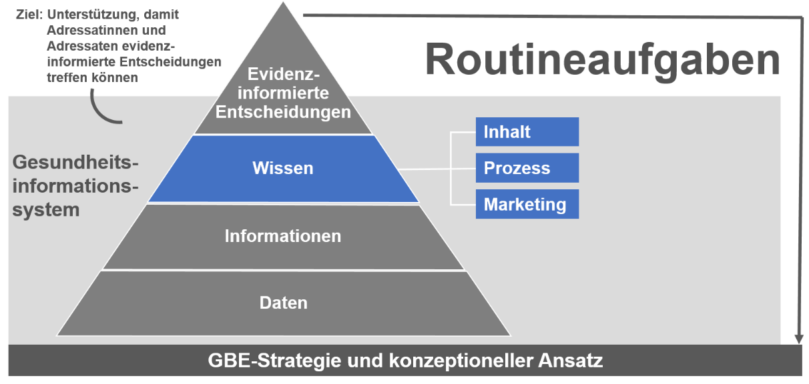

# {{page.title}}

 
  
 
      &#9658; Inhaltsverzeichnis Kapitel (ausklappbar) 
  

 
1. TOC
{:toc}
 

 
 
> „Ich habe schon den dritten Bericht geschrieben in diesem Jahr, kann
> schon ein bisschen stolz sein. Aber wenn ich mich so bei uns umschaue,
> weiß echt keiner, dass das so ist. Ignoranten und Ignorantinnen,
> tolles Material und steht alles im Internet\!“

## Vernetzung der verschiedenen Ebenen von Gesundheitsberichterstattung

Gesundheitsberichterstattung auf kommunaler, Länder- und Bundesebene hat
unterschiedliche Schwerpunkte, jedoch steht bei allen die Information
zur Verbesserung der Gesundheit im Vordergrund. Daher ist es wichtig,
dass die unterschiedlichen Ebenen sowohl horizontal (innerhalb der
Kommune und zwischen Kommunen) als auch vertikal (etwa die
Zusammenarbeit von Länder- und Bundes-GBE) zusammenarbeiten. Zu dieser
Zusammenarbeit gehören vor allem die Harmonisierung der Datenquellen und
Indikatoren sowie die gemeinsame Definition von Verfahren. Daneben ist
eine gemeinsame thematische Schwerpunktsetzung oder die Zusammenarbeit
bei der Berichterstellung denkbar. Innerhalb der
GBE-Informationspyramide liegt hierbei ein besonderes Augenmerk auf dem
Prozess der Wissensgenerierung, wie in Abbildung 11 dargestellt.

 <figure>
  
  <figcaption>Abbildung 11 Prozess der Wissensgenerierung in der GBE anhand der Informationspyramide (Erweiterte erweiterte Darstellung nach Verschuuren und van Oers 2019 (Verschuuren, van Oers 2019))</figcaption>
</figure> 

## GBE als Teil eines Netzwerkes

Gesundheitsberichterstatterinnen und Gesundheitsberichterstatter
bedürfen einer Reihe methodisch-fachlicher Kompetenzen (siehe [Kapitel 4]({{ site.baseurl }}), gleichzeitig agieren sie nicht in einem Vakuum. Berichterstattung
ist bestenfalls ein interdisziplinärer, multiprofessioneller Prozess
(siehe [Kapitel 5]({{ site.baseurl }})). Eine wesentliche Qualifikation der Berichterstatter
und Berichterstatterinnen neben methodisch-fachlichen Kompetenzen ist
die Kommunikations- und Netzwerkkompetenz. Ihre Aufgabe ist verbunden
mit anderen Bereichen der Verwaltung sowie Akteurinnen und Akteuren aus
den unterschiedlichsten Feldern von der Arbeitsagentur bis zur
Zahnprophylaxe.

Gesundheitsberichterstattung steht nicht für sich allein, sondern ist
eingebettet in einen kontinuierlichen Prozess aus Problemdefinition,
strategischer Planung, Umsetzung und Bewertung, wie einleitend bereits
anhand des „Public Health Action Cycles“ in [Kapitel 2]({{ site.baseurl }}) erläutert. Weiter
speist sich die Gesundheitsberichterstattung aus verschiedenen Themen,
konkret nicht nur rein medizinischen, sondern auch aus solchen mit Bezug
zu den Lebensverhältnissen (zum Beispiel Einkommen, Kultur, Bildung),
zur Umwelt (etwa Lärm, Schadstoffe, Hitze) oder zum Wohnen
(beispielsweise Grünflächen, Infrastruktur). Während
Berichterstatterinnen und Berichterstatter ihre methodisch-fachlichen
Kompetenzen bei der Berichterstellung einbringen, bedarf es ihrer
kommunikativen Kompetenz, um Partner und Partnerinnen für diesen Prozess
zu gewinnen, und Mut, um sich gewinnen zu lassen. Idealerweise gibt es
in der Kommune bereits eine Vernetzungsstruktur, auf die sie
zurückgreifen können, zum Beispiel die Integrierte Gesundheits- und
Sozialberichterstattung (Berlin), das Sozialmonitoring (Stuttgart) oder
die Kommunalen Gesundheitskonferenzen (KGK), die in verschiedenen
Bundesländern gesetzlich verankert und etabliert sind. Eine Übersicht zu
den gesetzlichen Rahmenbedingungen der GBE findet sich in [Kapitel 1]({{ site.baseurl }}).

**Mögliche Partnerinnen und Partner innerhalb der Verwaltung sind unter
anderem:**

  - je nach Thema Kollegen und Kolleginnen aus dem eigenen
    Gesundheitsamt (zum Beispiel Psychiatrie- und Suchtkoordination,
    Kinder- und Jugendgesundheitsdienst, Gesundheitsförderung,
    Gesundheitsplanung, Infektionsschutz, Umweltmedizin)

  - Statistikamt

  - Sozialamt

  - Jugendamt

  - Umweltamt

  - Katasteramt

  - Ämter für Stadtplanung und -entwicklung

  - Schulverwaltungsamt/Amt für Bildung

  - Amt für Sport/Bewegung, Stadtsportbund

  - Beauftragte der Kommune für Kinder

  - Beauftragte der Kommune für die Belange von Menschen mit Behinderung

  - Beauftragter/Beauftragte für Seniorinnen und Senioren/Beirat der
    Seniorinnen und Senioren

  - Beauftragte der Kommune für Integration

  - Gleichstellungsbeauftragte

  - Pressestelle

  - ...

**Mögliche Partner und Partnerinnen außerhalb der Verwaltung sind unter
anderem:**

  - ambulante und stationäre Versorgung

  - Rettungsdienste

  - ambulante und stationäre Pflege

  - niedergelassene Ärztinnen und Ärzte unterschiedlicher Fachrichtungen

  - Organe der Selbstverwaltung (Kassen(zahn)ärztliche Vereinigung,
    (Zahn-)Ärztekammer, Psychotherapeutenkammer)

  - gesetzliche und private Krankenkassen

  - Flüchtlingsrat

  - Medien

  - Jobcenter/Agentur für Arbeit

  - bereits vorhandene Arbeitsgruppen und Arbeitskreise, zum Beispiel
    Suchtprävention, Psychosoziale Arbeitsgemeinschaft (PSAG)

  - ...

### Themenbezogene Projektgruppe

Für die Erstellung eines thematisch eingegrenzten Berichts bietet es
sich gegebenenfalls an, eine temporäre Projektgruppe zum Berichtsthema
zu gründen. Potenzielle Teilnehmer und Teilnehmerinnen der Projektgruppe
sind alle Personen in der Kommune, die etwas zum Thema beitragen können
und die möglicherweise bei der Umsetzung von Maßnahmen, die aus dem
Bericht folgen könnten, involviert werden sollten oder betroffen sind.
Dies könnten zum Beispiel Träger von Einrichtungen der Kinder- und
Jugendhilfe oder der Altenhilfe sein.

Erfahrungsgemäß gibt es häufiger Vorbehalte von einzelnen Institutionen,
Ressorts, Ämtern oder Interessensvertreterinnen und Interessensvertreter
gegenüber einem geplanten Gesundheitsbericht. Sie fürchten zum Beispiel,
in einem Bericht nicht gut „dazustehen“, oder haben Sorge, sich den
Handlungsempfehlungen nicht gewachsen zu fühlen mangels Ressourcen
und/oder politischen Rückhalts der Verwaltung und Kommunalpolitik etc.
Hier ist es sinnvoll, insbesondere diese Gruppen von Anfang an
einzubeziehen und das Vorgehen (Datenerhebung, Auswertung,
Interpretation) transparent zu machen. Gleichzeitig müssen
Berichterstatter und Berichterstatterinnen kommunikatives Geschick
haben, um sich aktiv in Prozesse einzubringen und von anderen als
Partnerinnen und Partner mit starker Stimme für gesundheitsorientierte
Themen wahrgenommen zu werden.

Insbesondere bei der Interpretation der Ergebnisse und der daraus
abzuleitenden Handlungsempfehlungen kommt der Projektgruppe bzw. den
betroffenen Institutionen eine wichtige Rolle zu. Dabei haben
Gesundheitsberichterstatterinnen und Gesundheitsberichterstatter die
Rolle, gemeinsam mit Partnern und Partnerinnen bzw. Akteuren und
Akteurinnen wissenschaftlich fundierte Handlungsempfehlungen zu
erarbeiten, wobei sie die Umsetzbarkeit vor Ort im Blick haben müssen
(siehe [Kapitel 7]({{ site.baseurl }})). Hier bewegen sich Gesundheitsberichterstatterinnen
und Gesundheitsberichterstatter im Spannungsfeld von Wissenschaft,
Praxis und – nicht zuletzt – Politik.

Insbesondere bei der Integration verschiedener
Berichtserstattungssysteme werden unterschiedliche Schnittstellen in
Anspruch genommen, und neben dem fachlichen Austausch stehen die Klärung
sowie Integration unterschiedlicher Erwartungen und Interessen an (siehe
auch [Kapitel 5]({{ site.baseurl }})). Aus Sicht der beteiligten Ressorts kann es zu
unterschiedlichen Prioritäten kommen, ebenso wie die
Gesundheitsberichterstattung als reine Dienstleisterin für andere
Ressorts betrachtet werden kann, was ihrer Stellung innerhalb des
Systems nicht gerecht wird. Bei der (technischen) Integration
verschiedener Berichterstattungssysteme innerhalb einer Kommune kann es
bezüglich der räumlichen Bezugsebene für die Gesundheitsdaten zu
Schwierigkeiten kommen. Sozial- oder Einwohnerdaten können sehr
kleinräumig dargestellt werden (Stadtteile, Quartiere, Baublocks). Für
Gesundheitsdaten ist dies aus Gründen des Datenschutzes oft nicht
möglich, weil die Fallzahlen zu gering sind. Deshalb müssen hier
gemeinschaftlich Lösungen für eine einheitliche Darstellung gefunden
werden. Ein besonderes Augenmerk muss hierbei dem Datenschutz zukommen.

### Politik und Entscheidungsträgerinnen und Entscheidungsträger 

Egal, ob der Auftrag für einen Gesundheitsbericht „von oben“ erteilt
wurde oder die Notwendigkeit für einen Bericht aus der GBE selbst kam:
Wichtige Entscheidungsträgerinnen und Entscheidungsträger sollten
kontinuierlich informiert sowie gegebenenfalls überzeugt und eingebunden
werden (siehe auch [Kapitel 2]({{ site.baseurl }}) und [Kapitel 3]({{ site.baseurl }})).

Dazu gehören unter anderem:

  - Amts- und Abteilungsleitung

  - Dezernent oder Dezernentin

  - Landrat oder Landrätin, (Ober-)Bürgermeister oder
    (Ober-)Bürgermeisterin

  - Gremien wie Kreistag, Stadtrat, Gemeinderat, Ortschaftsrat

Die Einbindung der politischen Leitungsebene ist ohnehin notwendig, weil
ein Gesundheitsbericht in der Regel nicht vom GBE-Team veröffentlicht
wird, sondern vom Landratsamt oder der Stadt. Die politische Leitung
muss den Bericht also vertreten. Hinzu kommt, dass Partnerinnen und
Partner für die Verbreitung eines Berichts gebraucht werden. Die
Wahrnehmung der Berichterstattung hängt ganz entscheidend davon ab, wie
gut der Weg vorher bereitet wurde. Im schlimmsten Fall kann es
passieren, dass ein Bericht in der Schublade verschwindet oder sich
niemand imstande sieht, sich der Themen anzunehmen bzw. Verantwortung zu
übernehmen. Die zeitliche Komponente ist ebenfalls entscheidend:
Sitzungstermine der Gremien, Haushaltsberatungen, (Kommunal-)Wahlen,
Ausnahmesituationen (Corona, Migrationsdynamik etc.), Sommerpause oder
„Sommerloch“ sollten immer bedacht werden. Neben dem Interesse spielen
dabei auch die Kompetenzen der Adressaten und Adressatinnen eine
wesentliche Rolle.

## Kompetenzentwicklung innerhalb des Netzwerkes (Capacity Building)

In [Kapitel 4]({{ site.baseurl }}) ist die erforderliche methodisch-fachliche Qualifikation
von Gesundheitsberichterstatterinnen und Gesundheitsberichterstattern
bereits kurz skizziert worden. Dies ist die Grundlage für
Berichterstatter und Berichterstatterinnen, die sie in die Lage
versetzt, den Aspekt der Vernetzung zu verfolgen. Innerhalb des
Netzwerkes ist die Kompetenzentwicklung ein fortlaufender Lernprozess
aller Beteiligten. Capacity Building (Kompetenzentwicklung) beschreibt
ein prozesshaftes Geschehen, bei dem das Voneinander-Lernen im
Mittelpunkt steht. Hier hilft es den Berichterstatterinnen und
Berichterstattern, „einen langen Atem zu haben“ und
Frustrationserlebnisse als Teil dieses Prozesses einzuordnen sowie nicht
den Mut zu verlieren.

Die Kooperation und das vernetzte Arbeiten über verwaltungsinterne und
externe Ressorts und Sektoren hinweg erfordert ein stetiges Bewusstsein
eigener Positionen und Interessen und der Positionen und Interessen der
anderen Partner und Partnerinnen (Quilling et al. 2013; Fisher et al.
2009).

Gesundheitsberichterstattung erfordert aufseiten der
Berichterstatterinnen und Berichterstatter verschiedene Qualifikationen,
was auch aus der in [Kapitel 4]({{ site.baseurl }}) dargestellten Stellenausschreibung
ersichtlich wird. Gleichzeitig sind für einen verantwortungsvollen
Umgang mit Gesundheitsberichten gewisse Kompetenzen nötig und erwünscht.
Gesundheitsberichterstattung steht im Spannungsfeld von Wissenschaft,
Politik, Medien und Öffentlichkeit, bestenfalls ist sie Mittlerin
zwischen wissenschaftlichen Erkenntnissen bzw. Ergebnissen empirisch
fundierter Analysen und politisch Handelnden bzw. Bürgern und
Bürgerinnen (siehe auch [Kapitel 2]({{ site.baseurl }})).

Erkenntnisse wissenschaftlicher Studien aus verschiedenen Fachbereichen,
zum Beispiel der Epidemiologie, Medizinsoziologie,
Gesundheitswissenschaften, Public Health, um nur einige zu nennen,
können in zweierlei Hinsicht genutzt werden: Einerseits dienen sie als
Ausgangspunkt für Fragestellungen der eigenen
Gesundheitsberichterstattung, andererseits – wie oben bereits erwähnt –
können sie zu Vergleichen herangezogen werden, etwa mit Blick auf sozial
ungleiche Gesundheitschancen in der Bevölkerung. Gleichzeitig können im
Rahmen der GBE eigene Erhebungen durchgeführt werden, die die Prinzipien
wissenschaftlichen Arbeitens beherzigen sollten. Hierzu gibt die „Gute
Praxis Gesundheitsberichterstattung 2.0“ Empfehlungen und zu prüfende
Kriterien (Starke et al. 2019). Gerade dann, wenn eigene Untersuchungen
durchgeführt werden, sind Kompetenzen sozialwissenschaftlicher und
empirischer Forschungsmethoden notwendig (siehe auch [Kapitel 4]({{ site.baseurl }})). Die
Ergebnisse eigener Untersuchungen oder auch der Vergleich mit
Erkenntnissen wissenschaftlicher Studien erfordert einen sensiblen
Umgang mit erhobenen Daten und den jeweiligen Hinweis, dass die
Ergebnisse der eigenen Erhebung möglicherweise populationsspezifisch
sind und nicht auf die Gesamtbevölkerung übertragen werden können.
Hinsichtlich der Vergleiche eigener Beobachtungen mit Studienergebnissen
sind die Vergleichbarkeit der untersuchten Population, der Kontext und
die Übertragbarkeit spezifischer Ergebnisse auf die „eigene“ Bevölkerung
in der Kommune zu reflektieren.

GBE beschreibt die gesundheitliche Lage der Bevölkerung mittels
unterschiedlicher Daten und Kennzahlen, verknüpft diese unter
Berücksichtigung der oben genannten Aspekte mit wissenschaftlichen
Erkenntnissen zu gesundheitsbezogenen Themen **(Kontextualisierung)**,
interpretiert und formuliert Handlungsempfehlungen, sinnvollerweise
gemeinsam mit anderen Akteurinnen und Akteuren sowie Expertinnen und
Experten. Mit Ausnahme der Fachöffentlichkeit sowie
Wissenschaftsjournalisten und Wissenschaftsjournalistinnen sind die
Empfänger und Empfängerinnen der in Gesundheitsberichten dargestellten
Inhalte mehrheitlich weder im Umgang mit Daten noch mit
wissenschaftlichen Aussagen geschult. Daraus resultiert auf der einen
Seite der Anspruch an die Gesundheitsberichterstattung, **adressatinnen-
und adressatengerecht** zu formulieren und Sachverhalte darzustellen.
Auf der anderen Seite ist eine Kompetenzentwicklung im Umgang mit
Gesundheitsberichten erstrebenswert. Kompetenzentwicklung bei Adressaten
und Adressatinnen von Gesundheitsberichten zielt auf unterschiedliche
Bereiche ab. Hier sind zu nennen: Umgang mit Daten, Grafiken,
gesundheitsbezogenen Themen und darauf basierenden Empfehlungen. Nun
stellen Daten und Zahlen im Allgemeinen für viele Menschen eine
Herausforderung dar (Kuhn, Wildner 2019). Sich diesen anzunähern und ein
Verständnis dafür zu entwickeln – ohne die Tiefen der Statistik zu
durchdringen –, erfordert Offenheit und Respekt für das Dargestellte. Es
bedarf einer **unvoreingenommenen Haltung**, die durch die oben
beschriebene Einbindung in den Prozess der Berichterstattung erleichtert
werden kann. In der Berichterstattung fehlt es oft an Möglichkeiten,
Ursache-Wirkungs-Mechanismen durch Daten zu belegen. Sie bewegt sich
häufig auf der Ebene, unterschiedliche Beobachtungen miteinander in
Verbindung zu bringen (Assoziationen), ohne über Daten zu verfügen, die
miteinander verbunden sind (Beispiel: Verknüpfung prozentualen Anteils
Adipositas mit prozentualem Anteil nicht-autochthoner Menschen). Um
solchen ökologischen Fehlschlüssen vorzubeugen, ist nicht nur Obacht bei
der Berichterstattung vonnöten, sondern eine vorurteilsfreie
Auseinandersetzung mit dem Bericht selbst aufseiten der Adressatinnen
und Adressaten (siehe auch [Kapitel 4]({{ site.baseurl }})).

**Grafiken** – und insbesondere kartografische Darstellungen – sind
beliebte Elemente in der GBE, um Sachverhalte veranschaulichen zu können
(Augustin et al. 2017). Gleichermaßen bergen sie unzählige Möglichkeiten
zur Manipulation. Dass dieses nicht opportun und wider den Prinzipien
wissenschaftlichen Arbeitens ist, wird von der Boulevardpresse oftmals
(bewusst) ignoriert. Berichterstatter und Berichterstatterinnen sollten
deshalb kompetent sein, Grafiken zu erstellen. Gleichwohl können sie
nicht intendierten Fehlinterpretationen den Weg ebnen, wenn mit der
Absicht, Darstellungen zu vereinfachen, ein Format gewählt wird, dass
etwa Unterschiede überbetont (Beispiel: Die x-Achse schneidet y-Achse
nicht bei null.). Adressatinnen und Adressaten der GBE bedürfen der
Kompetenz, Grafiken zu „lesen“ und zu interpretieren. Hier kann es von
Nutzen sein, unterschiedliche Darstellungen ein und desselben
Sachverhalts exemplarisch und außerhalb des Berichts zu präsentieren, um
ein Verständnis für die Vielfalt der Darstellungsoptionen zu entwickeln.

Die inhaltliche Auseinandersetzung mit gesundheitsbezogenen Themen unter
Berücksichtigung wissenschaftlicher Erkenntnisse stellt für
Berichterstatterinnen und Berichterstatter sowie für Rezipienten und
Rezipientinnen eine Herausforderung dar. Die günstigste Konstellation
(abgesehen von Sachverständnis auf beiden Seiten) ist diejenige, bei der
Berichterstatter und Berichterstatterinnen ein Thema so durchdringen,
dass sie komplexe Inhalte einfach beschreiben können, ohne banal zu
wirken. Die Fähigkeit, sich unvoreingenommen auf unbekannte Sachverhalte
einzulassen, bedarf bei den Adressatinnen und Adressaten des Berichts
einer großen Portion Neugier. Medizinische, gesellschaftliche und
psychologische Einflussfaktoren auf Gesundheit (siehe auch [Kapitel 2]({{ site.baseurl }}))
sind oftmals in der Bevölkerung wenig bekannt, sodass die
Auseinandersetzung damit schnell zu einer individuellen Zuschreibung der
Verantwortung führt, statt strukturell bedingte Vulnerabilität in den
Blick zu nehmen.

Wie oben bereits angesprochen, stehen die aus den Ergebnissen des
Berichts abgeleiteten Handlungsempfehlungen unter „besonderer
Beobachtung“. Selbst wenn die Formulierung wissenschaftlich fundierter
Handlungsempfehlungen durch die Berichterstatter und
Berichterstatterinnen gemeinsam mit Expertinnen und Experten erfolgt,
besteht die Gefahr, dass Adressaten und Adressatinnen sich diesen nicht
gewachsen fühlen, sie nicht als ihr originäres Handlungsfeld ansehen
oder sie schlicht ablehnen. Handlungsempfehlungen müssen auf Resonanz
treffen, um eine Chance auf Umsetzung zu haben. Ähnlich wie ein Cello
einen wunderbaren Resonanzkörper hat, der aber ohne sachkundige
Cellospielerin oder sachkundigen Cellospieler nie klingen wird, werden
Berichte wenig Wirkung entfalten, wenn Handlungsempfehlungen nicht auf
Resonanzfähigkeit seitens der Akteure und Akteurinnen treffen.

## Weiterführende Informationen

Capacity Building in der GBE

  - Bachinger E, Grasser G (2009): Capacity Building für
    Gesundheitsberichterstattung. In: Kuhn J und Böcken J (Hrsg.):
    Verwaltete Gesundheit. Konzepte der Gesundheitsberichterstattung in
    der Diskussion. Frankfurt: Mabuse-Verl. (Beiträge zur politischen
    Relevanz der Gesundheitsberichterstattung), S. 201–222.

  - Kuhn J, Zapf A (2018): Berufliche Aufgaben und Perspektiven im ÖGD.
    In: Public Health Forum 26 (1), S. 20–22. DOI:
    10.1515/pubhef-2017-0083.

<!-- end list -->

  - …

Beteiligung und Partizipation

  - LGA-BW (2014): Handlungsempfehlung zur Bürgerbeteiligung bei
    Gesundheitsthemen. aus den Pilotgesundheitsdialogen im Rahmen des
    Zukunftsplans Gesundheit, Juli 2014.

  - …

## Literaturverzeichnis Kapitel 6. – Vernetzung in der GBE

Augustin J, Kistemann T, Koller D, Lentz S, Maier W A, Moser J,
Schweikart J (Hrsg.) (2017): Gute kartographische Praxis im
Gesundheitswesen (GKPiG). Deutsche Gesellschaft für Geographie; Deutsche
Gesellschaft für Epidemiologie; Leibniz-Institut für Länderkunde.
Leipzig: Leibniz-Institut für Länderkunde (Forum IfL, Heft 32). Online
verfügbar unter
http://nbn-resolving.de/urn:nbn:de:0168-ssoar-52071-9.Fisher R, Ury W,
Patton B (2009): Das Harvard-Konzept. Der Klassiker der
Verhandlungstechnik. 23., durchgesehene Aufl. Frankfurt/Main, New York:
Campus-Verl. Online verfügbar unter
http://swb.eblib.com/patron/FullRecord.aspx?p=825186.Kuhn J, Wildner M
(2019): Gesundheitsdaten verstehen. Statistiken lesen lernen – ein
Einsteigerbuch. 2., vollständig überarbeitete und erweiterte Auflage.
Bern: Hogrefe.Quilling E, Nicolini H J, Graf C, Starke D (2013):
Praxiswissen Netzwerkarbeit. Gemeinnützige Netzwerke erfolgreich
gestalten. Wiesbaden, s.l.: Springer Fachmedien Wiesbaden
(SpringerLink). Online verfügbar unter
http://site.ebrary.com/lib/alltitles/docDetail.action?docID=10756602.Starke
D, Tempel G, Butler J, Starker A, Zühlke C, Borrmann B (2019): Gute
Praxis Gesundheitsberichterstattung – Leitlinien und Empfehlungen 2.0.
In: *Journal of Health Monitoring* 4 (S1), S. 1–22.Verschuuren M, van
Oers H (Hrsg.) (2019): Population Health Monitoring. Cham: Springer
International Publishing.
