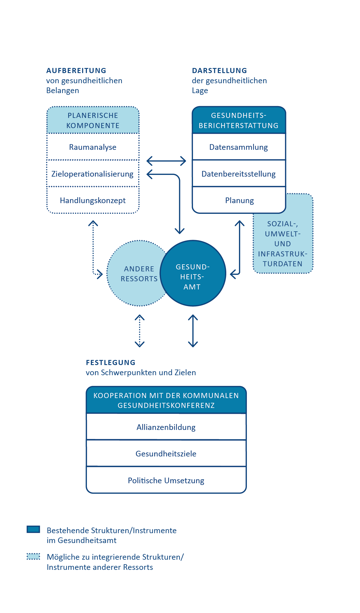

# 8. Wo will die Gesundheitsberichterstattung hin?

 
  
 
      &#9658; Inhaltsverzeichnis Kapitel (ausklappbar) 
  

 
1. TOC
{:toc}
 

 
 
> „Die GBE sollte meines Erachtens nach die Weltherrschaft anstreben.Dann wäre alles gut\!"

Gesundheitsberichterstattung hat das Ziel, eine verlässliche Informationsgrundlage für Entscheidungsprozesse und Maßnahmen der Akteurinnen und Akteure in Gesundheitspolitik und Public Health zu schaffen, um so einen Beitrag zur Verbesserung der Gesundheit der Bevölkerung und einzelner Bevölkerungsgruppen zu leisten. Wie wichtig verlässliche Informationen für gesundheitspolitische Maßnahmen auf Bundes-, Länder- und kommunaler Ebene sind, wurde nicht zuletzt bei der aktuellen Corona-Pandemie und ihren Folgen deutlich. „Sauberes Wissen“ ist eine wichtige Ressource, wenn es darum geht, Präventionsmaßnahmen evidenz-informiert abzuleiten und gemeinsam mit der Bevölkerung umzusetzen. Dazu ist Vertrauen in die Informationen, die Behörden liefern, unverzichtbar. Gute Daten und ihre wissenschaftlich fundierte Aufarbeitung sind eine Voraussetzung dafür. So gesehen kann die Gesundheitsberichterstattung nicht nur Daten für Gesundheitspolitik bereitstellen, sondern auch die Gesundheitskompetenz der Bürgerinnen und Bürger unterstützen.

In den vorangegangenen Kapiteln wurden die Arbeitsweise und das Handwerkszeug für die GBE auf kommunaler Ebene dargestellt. Dabei wurde vielfach eine Idealvorstellung skizziert, die, zum Teil aufgrund fehlender Ressourcen, nicht flächendeckend sichergestellt werden kann. Daraus ergeben sich ganz konkrete Ziele und Ansatzpunkte zur inhaltlich-fachlichen Weiterentwicklung der GBE, die im Folgenden kurz dargestellt werden sollen.

## 8.1. Weitergefasste Ziele 

Die **Datengrundlagen der GBE** entwickeln sich laufend weiter. Aktuell lässt sich beispielsweise eine starke Dynamik bei den Nutzungsmöglichkeiten der Daten der Gesetzlichen Krankenversicherungen (GKV-Daten) beobachten, wodurch sich viele Optionen für kleinräumige Analysen und Zeitreihen ergeben. Auch die Entwicklungen bei Big Data und die Nutzung künstlicher Intelligenz werden in der Gesundheitsberichterstattung zumindest auf Bundesebene vermutlich eine wichtige Rolle spielen. Die Nutzung dieser Datenquellen erfordert dabei zusätzliche GBE-Ressourcen, sowohl auf der technischen IT-Ebene als auch im Bereich Personalressourcen. 

Auch die **Kommunikationsformen** entwickeln sich stetig weiter: Der Ausbau interaktiver Daten- und Visualisierungsmöglichkeiten stellt eine wichtige Chance für die GBE dar. Durch die Entwicklung gemeinsamer Standards, Indikatoren und Empfehlungen würden sich zusätzliche Synergien der Gesundheitsberichterstattung in der kommunalen, Länder- und Bundes-GBE ergeben. Durch Nutzung gemeinsamer Gesundheitsinformationssysteme wären relevante Gesundheitsdaten in einheitlicher Form verfügbar und könnten von unterschiedlichen Nutzerinnen und Nutzern nach gemeinsamen Standards genutzt werden. 

Auch für die **gemeinsame Erstellung von Berichten** bieten sich unterschiedliche Plattformen an, um gemeinsam Projekte zu planen, zu analysieren und zu publizieren. Denkbar wären hier ebenso vergleichsweise neue Konzepte wie beispielsweise ein Book Sprint zur gemeinsamen Erstellung eines Gesundheitsberichts. Darüber hinaus bestehen **Schnittstellen zu möglichen anderen Berichtsformaten**, zum Beispiel Blogs, die den Leserinnen und Lesern neue Möglichkeiten zur Beteiligung an der gesellschaftlichen Debatte darüber ggibt, wie es den Menschen geht. Die neuen medialen Instrumente könnten so auch einen Beitrag zur Realisierung der Idee einer partizipativen Gesundheitsberichterstattung leisten. Die GBE muss außerdem die sozialen Medien und verschiedene Plattformen stärker für die Ergebnisdisseminierung nutzen. Zum einen werden so zusätzliche Nutzerinnen und Nutzer der GBE erreicht, zum anderen könnte so die GBE mit ihren verlässlichen Daten einen Kontrapunkt zu Fake News im Internet darstellen. 

Die **wissenschaftliche Weiterentwicklung der Gesundheitsberichterstattung** setzt eine enge interdisziplinäre Zusammenarbeit voraus: So müssen Erkenntnisse und Anforderungen der Public-Health- und Kommunikationswissenschaften sowie der Data Sciences integriert werden. Auch ist es wichtig, das Thema der Gesundheitsberichterstattung in Forschung und Lehre der Gesundheitswissenschaften weiter zu platzieren. Ein wichtiger Baustein ist dabei der Ausbau der Zusammenarbeit von Universitäten und Hochschulen mit dem Öffentlichen Gesundheitsdienst. 

Neben der Weiterentwicklung der Gesundheitsberichterstattung auf der wissenschaftlichen Ebene stellt auch der Ausbau von **Partizipation bei der Themenwahl** und der Berichterstellung eine künftige Aufgabe dar. 

Ein weiteres wichtiges Potenzial der Gesundheitsberichterstattung liegt in der **Stärkung der internationalen Betrachtung von Gesundheitsdaten und Methoden für die GBE**. In fast allen Ländern der EU besteht ein nationales GBE-System. Für grenzüberschreitende Analysen und Berichte wäre es wichtig, im EU-Raum eine Einrichtung für Public Health zu schaffen, in der internationale GBE angesiedelt werden kann. Auch auf der globalen Ebene sollte die Zusammenarbeit mit der WHO gestärkt werden. Aus dieser Zusammenarbeit ergeben sich häufig Ideen, die ebenfalls für die GBE und Planung in Deutschland hilfreich sein können. Dies hat den Vorteil, dass das Rad nicht ständig neu erfunden werden muss. Ein konkretes Beispiel ist das schottische Place Standard Tool, dass Kommunen dabei unterstützt, Einschätzungen des alltäglichen Lebensumfelds der Bürgerinnen und Bürger in einem standardisierten Verfahren zu sammeln und prioritäre Handlungsfelder für verhältnispräventive Maßnahmen zu identifizieren. Das Tool ist bereits in vielen europäischen Ländern auf Anerkennung gestoßen \([Talking „place“ – a public health conversation for everyone?](https://eurohealthnet-magazine.eu/talking-place-a-public-health-conversation-for-everyone/)\). In Deutschland wurde das Tool von der Bundeszentrale für gesundheitliche Aufklärung in Kooperation mit den Ländern Baden-Württemberg und Nordrhein-Westfalen sowie vier Pilotkommunen übersetzt und erprobt und steht als [StadtRaumMonitor](https://www.bzga.de/aktuelles/2020-09-24-stadtraummonitor-wie-lebenswert-finde-ich-meine-umgebung/) seit dem Sommer 2022 bundesweit zur Verfügung.

Die Gesundheitsministerkonferenz hat 2018 ein **modernes Leitbild für den ÖGD** verabschiedet (länderoffene Projektgruppe Leitbild ÖGD 2018). Es soll dabei helfen, dem ÖGD ein zukunftsorientiertes Profil zu geben und dabei neben den klassischen Aufgaben der Überwachung und Kontrolle, etwa im Infektionsschutz oder in der Krankenhaushygiene, auch den Aufgaben der Koordination, Vernetzung und Planung mehr Stellenwert zuzumessen. Dabei gehört der Bereich Kommunikation, Moderation, Anwaltschaft und Politikberatung ebenfalls zu den Kernaufgaben des ÖGD. Die Gesundheitsberichterstattung ist in diesem Zusammenhang ein wichtiges Instrument, um diese Aufgaben zu erfüllgen. Mit ihren unterschiedlichen und neuen Kommunikationskanälen kann die GBE noch besser dazu beitragen, die **Evidenzbasierung der (gesundheits-)politischen Willensbildung und Entscheidungen** zu stärken.

In letztgenanntem Sinne wäre es wünschenswert, wenn dem kommunalen ÖGD mehr Steuerungsaufgaben zugeschrieben würden, sei es in den Gesundheitsdienstgesetzen (GDG) der Länder oder bei der Umsetzung übergeordneter Gesetze wie dem Präventionsgesetz. Wer kommunal gesundheitspolitisch steuern will, benötigt dafür mindestens mittelfristig eine solide Informationsbasis, das heißt eine kommunale GBE. Um die kommunale GBE als Kernaufgabe des ÖGD mit vergleichbaren Standards zu etablieren, wäre es notwendig, die landesgesetzlichen Aufträge hinsichtlich Steuerung und Berichtswesen über das bisherige Maß hinaus zu homogenisieren.

Die Weiterentwicklung der Gesundheitsberichterstattung mit der Nutzung neuer Möglichkeiten und als Antwort auf neue Anforderungen ist eine Zukunftsaufgabe, die nicht mit den bestehenden Kapazitäten der Gesundheitsberichterstattung realisiert werden kann. Um auch weiterhin verlässliche Informationen zur Gesundheit für unterschiedliche Nutzerinnen und Nutzern bereitstellen zu können, ist ein Ausbau der Gesundheitsberichterstattung auf allen Ebenen (Bund, Länder, Kommunen) erforderlich. Ein starkes Public-Health-System mit Gesundheitsberichterstattung als festem Bestandteil ist erforderlich, um die Gesundheit aller Menschen in Deutschland zu schützen und zu verbessern.

<table>
<tbody>
<tr class="odd">
<td><h5 id="exkurs-gbe-während-der-corona-pandemie" class="list-paragraph">Exkurs: GBE während der Corona-Pandemie</h5>

Während der COVID-19-Pandemie stand die (kommunale) GBE vor besonderen Aufgaben: Politische Entscheidungsträger benötigen einen tagesaktuellen Überblick über Infektionszahlen, Inzidenzraten, Hotspots der Pandemie und besonders betroffene Bevölkerungsgruppen. Die Herausforderung bestand hier in der <strong>kurzfristigen, täglichen Berichterstattung</strong>, für die herkömmliche GBE-Formate bis heute nicht geeignet sind. Die zeitnahe Datenbereitstellung für Politik und Öffentlichkeit erfolgte daher oft über andere Wege, wobei die GBE aber oftmals mittelbar tangiert war. Automatisierte Datenabfragen und die automatisierte Erstellung von Statistiken, die Einspeisung von Daten in Dashboards und andere interaktive Datenpräsentationen waren für kommunale GBElerinnen und GBEler zumeist neue Aufgaben. Nun gilt es zu prüfen, inwiefern diese Erfahrungen und gegebenenfalls auch das neu erworbene Wissen sowie die verwendeten Tools für die „reguläre“ GBE genutzt werden.
Eine weitere eigenständige GBE-Aufgabe könnte es sein, im Nachgang zur Krise einen Gesundheitsbericht über Corona zu erstellen, mit den gesamten Verlaufsdaten zur Epidemie und ergänzenden Daten zum Beispiel aus dem Versorgungssystem. Aber auch eine Berichterstattung, die mögliche gesundheitlich relevante Folgen der Pandemie und die Bekämpfungsstrategien analysiert und aufzeichnet, ist denkbar.
In beiden Fällen gilt es wieder für die Gesundheitsberichterstatterin oder den Gesundheitsberichterstatter, Vernetzungsstrukturen aufzubauen und interdisziplinäres Arbeiten zu praktizieren: Infektionsepidemiologinnen und Infektionsepidemiologen, IT-Expertinnen und IT-Experten und die Pressestelle der Kommune stehen hier neben vielen weiteren wichtige Ansprechpersonen, mit denen die Anforderungen gemeinsam gelöst werden können.

</td>
</tr>
</tbody>
</table>

## 8.2. Aktuelle Entwicklungen in der GBE 

### 8.2.1. Aufbau einer GBE-Forschungsdatenbank (GBE-Monitor)

Kommunale Steuerungsaufgaben wie die GBE sind landesgesetzlich und somit heterogen geregelt. GBE als gesetzliche Aufgabe findet sich wie in [Kapitel 3]({{ site.baseurl }}) beschrieben in nahezu allen GDG der Länder als Aufgabe des kommunalen ÖGD, jedoch in unterschiedlicher Ausprägung, Präzisierung und Kopplung mit Planungsprozessen (Rosenkötter et al. 2020). Die Umsetzung der kommunalen GBE als weisungsfreie Pflichtaufgabe variiert daneben auch aufgrund der vielerorts angespannten Personalsituation und der unter anderem aufgrund der Größe der Kommunen sehr unterschiedlichen strukturellen Rahmenbedingungen im ÖGD (Arnold et al. 2020). Diese Diversität ist gekoppelt mit einem eklatanten Forschungs- und Transparenzdefizit, welches sich unter anderem aus der mangelnden Verankerung ÖGD-relevanter Forschungsfragen in der Public-Health-Wissenschaft sowie aus Informationsdefiziten über die kommunale Ebene ergibt. Entsprechend sind fast alle Analysen zur kommunalen GBE regional oder thematisch begrenzt (Fertmann et al. 2004; Süß et al. 2007; Murza et al. 2005). Einzig in der Münchener GBE-Studie wurden 2007 alle kommunalen Gesundheitsämter deutschlandweit zum Stand der kommunalen GBE befragt (Stockmann et al. 2008): Aus dem verwertbaren Rücklauf von 195 Ämtern (47 %) gaben 75 % an, in den letzten fünf Jahren Gesundheitsberichte erstellt zu haben. Tiefergehende Analysen etwa zum Einfluss landesgesetzlicher Vorgaben auf die GBE waren aufgrund der Rahmenbedingungen der Befragung nicht möglich.

Der von der Hochschule Ravensburg-Weingarten in Kooperation mit der Akademie für Öffentliches Gesundheitswesen aufgebaute GBE-Monitor knüpft am beschriebenen Wissensdefizit und den zugrunde liegenden methodischen Problemen an. Im Jahre 2019 begonnen wurde eine bundesweite längsschnittliche Erhebung der kommunalen Gesundheitsberichte, die erstmalig ein repräsentatives Bild zur kommunalen GBE liefern und umfangreiche Analysen ermöglichen wird. Wichtige Fragen sind etwa, welche Kontextbedingungen mit welchen Berichtstypen, welchem Integrationsgrad sowie Gender-, Soziallage- und Handlungsbezug der kommunalen GBE assoziiert sind. Da bisherige Leuchtturmprojekte zur kommunalen GBE überzufällig häufig in Städten angesiedelt sind, wird ein besonderer Fokus dabei auch der GBE in Landkreisen gelten.

**Methodik:** Im November und Dezember 2019 erfolgte ein erstes deutschlandweites systematisches Screening der Internet-Auftritte aller kommunalen Gesundheitsämter zur Gesundheitsberichterstattung, ergänzt durch parallele offene Stichwortsuche per Suchmaschine. Die Stadtstaaten Berlin und Hamburg wurden als Kommunen behandelt. Die Grundgesamtheit umfasste somit 358 kommunale ÖGD-Einheiten, von denen 252 auf Landkreise, 65 auf Stadtkreise (inklusive Stadtstaaten) und 41 auf kumulierte ÖGD-Einheiten über mehrere Land- oder Stadtkreise entfielen. Erhoben wurde, ob kommunale Gesundheitsberichte seit dem Jahr 2010 existierten. Sofern möglich, wurden mindestens die letzten drei verfügbaren Berichte seit dem Jahr 2010 heruntergeladen und als Berichtspool abgelegt. Ebenfalls erhoben wurden Strukturinformationen zur kommunalen Anbindung des ÖGD an übergeordnete Dezernate bzw. Abteilungen, indem das zugehörige Verwaltungsorganigramm bzw. sonstige vorgehaltene Informationen zur Organisation heruntergeladen wurden. Das Screening erfolgte unabhängig durch je zwei Personen. Um die Sensitivität des Online-Screening-Verfahrens zu prüfen, wurde aus den kommunalen ÖGD-Einheiten, bei denen in beiden Screening-Durchläufen keine GBE gefunden wurde, eine Zufallsstichprobe von 80 Einheiten gezogen. Bei diesen Ämtern erfolgten im Februar 2020 teilstandardisierte Telefoninterviews zur Frage, ob im Zeitraum der letzten zehn Jahre Gesundheitsberichterstattung durchgeführt wurde. Während der Corona-Krise konnten insgesamt 72 Ämter befragt werden. Von dieser Gesamtstichprobe wurden die Fragen zur GBE von 60 Ämtern (83,3 %) beantwortet. Von diesen wurde jeweils vier Mal angegeben, dass GBE in Form interner Dokumente erfolge, die aber nicht zur Verfügung gestellt werden können, oder dass eine GBE zwar aktuell nicht existiere, aber im Aufbau sei (je 6,7 %). Zehn Ämter gaben an, dass GBE ausschließlich in Form einer Datenweitergabe an die übergeordnete Landesebene erfolge (16,7 %). Von zwei Ämtern wurde kommunale GBE berichtet (3,3 %) und ein im Screening nicht entdeckter Gesundheitsbericht wurde zugesandt (1,7 %). 

Der GBE-Monitor soll den Wissensstand über die kommunale GBE erweitern, aber keine eventuell sensiblen Informationen über die Kommunalverwaltung öffentlich machen. Sämtliche Ergebnisse des GBE-Monitors werden daher ausschließlich auf aggregierter Ebene analysiert und kommuniziert, wodurch keinerlei Rückschlüsse zum erhobenen Stand der GBE in einzelnen Kommunen möglich sein wird.

**Aktueller Stand:** Zurzeit erfolgen erste Veröffentlichungen der Ergebnisse des GBE-Monitors, einige dieser Ergebnisse sind bereits in dieses Buch eingeflossen. Daneben entstehen erste tiefer gehende Analysen unter anderem im Rahmen gesundheitswissenschaftlicher Abschlussarbeiten und parallel werden Teile des umfangreichen Datensatzes für weitergehende Analysen aufbereitet. Die 2019 erfolgte querschnittliche Erhebung soll ab 2021 longitudinal als Vollerhebung ausgebaut werden. Hierfür werden momentan die Rahmenbedingungen geschaffen.

**Kontakt- und Ansprechperson:** Bertram Szagun, [szagun@rwu.de](mailto:szagun@rwu.de)

### 8.2.2. Der Fachplan Gesundheit

**Hintergrund:** Bei der hier beschriebenen Gesundheitsplanung handelt es sich um ein prozessorientiertes Instrumentarium, welches aus dem ÖGD heraus entwickelt wird und bei dem der ÖGD als planender Initiator in Erscheinung tritt. Um diese Planung zu systematisieren, wurden in der Vergangenheit in einigen Bundesländern verschiedene Instrumente entwickelt. Als ein Beispiel wird nachfolgend das Konzept zum Fachplan Gesundheit vorgestellt, welches seit 2009 in Nordrhein-Westfalen stetig weiterentwickelt und erprobt wird.

Der Fachplan Gesundheit ist methodisch stark an andere, seit Langem zum Teil auch gesetzlich verankerte Fachplanungen (zum Beispiel Lärmaktionsplanung, Luftreinhalteplan, Landschaftsplanung, Bauleitplanung, aber auch örtliche Pflegeplanung) und Strategien (etwa Klimafolgenanpassungsstrategien, integrierte kommunale Entwicklungskonzepte) angelehnt. Er hat zum Ziel,

* gesundheitsbezogene Anliegen, sozialräumliche Besonderheiten und quartiersbezogene Handlungsbedarfe aktuell und vor allem prospektiv (räumlich) darzustellen,

* Handlungsempfehlungen und möglichst konkrete Planungsziele und Maßnahmenvorschläge zu erarbeiten sowie als Handlungskonzept zu formulieren und damit 

* gesundheitsbezogenem, verhältnisorientiertem Handeln in kommunalen Planungen mehr Stringenz, Transparenz, Konsens und vor allem Verbindlichkeit zu verleihen. 

Um diesem Anspruch gerecht zu werden, ist eine gut aufgestellte GBE zur (integrierten) Bestandsanalyse, Bedarfs- und Bedürfnisbestimmung und letztlich als Monitoringinstrument während und nach der Maßnahmenumsetzung extrem hilfreich (vgl. Abbildung 15).

<figure>

<figcaption>Abbildung 16: Komponenten bei der Entwicklung eines Fachplans Gesundheit (eigene Darstellung)</figcaption>
</figure>

**Methodik:** Zum Fachplan Gesundheit wurden Vorarbeiten (Fehr et al. 2011) sowie zwei fiktionale Fachpläne für den fiktiven Kreis „*Gesundbrunnen“* und die ebenso fiktive Stadt „*Healthhausen“* publiziert, die auf die jeweiligen Besonderheiten kreisfreier Stadt- und Landkreisebene eingehen. Diese Dokumente sind abrufbar unter [LZG.NRW Fachplan Gesundheit](https://www.lzg.nrw.de/9116816).

In den fiktionalen Fachplänen wurden Aufbau und mögliche Inhalte des Fachplans umrissen. Er basiert auf raumbezogenen gesundheitsrelevanten Informationen und kann daraus Voraussetzungen ableiten, die unter anderem die körperliche Aktivität der Bevölkerung oder die Gesundheitsförderung und gesundheitsbezogene Versorgung vulnerabler Bevölkerungsgruppen verbessern kann. So kann der Plan beispielsweise Bevölkerungsgruppen in mehrfach belasteten Situationen identifizieren und daraus entsprechende Maßnahmenvorschläge ableiten. Der große Vorteil dieses informellen Planungsinstruments liegt für den ÖGD darin begründet, dass sehr unterschiedliche gesundheitsrelevante Informationen bedarfsorientiert in der Kommune zusammengestellt werden können und in konkreten Handlungsempfehlungen münden.

**Aktueller Stand:** Das Konzept zum Fachplan Gesundheit wurde bereits mehrfach erprobt und zeigte vielfältige Potenziale gerade auch im Hinblick auf den Mehrwert integrierter Verfahrensweisen im kommunalen Verwaltungs- und Planungshandeln, eine gesundheitsförderliche Kommunalentwicklung sowie eine optimierte Ressourcensteuerung im ÖGD auf. Jedoch wurden auch rechtlich-administrative und ressourcenbezogene Grenzen ersichtlich. So kann ein Fachplanprozess trotz erwarteten Mehrwerts kaum ressourcenneutral angeschoben werden und erfordert ein starkes Engagement auf verwaltungspolitischer Ebene. Ohne Rats- oder Kreistagsbeschluss besteht ein hohes Risiko, dass der Fachplan wirkungslos bleibt (Claßen, Mekel 2020). Dennoch haben zwischenzeitig mehrere Kommunen in NRW begonnen, Fachpläne Gesundheit zu erstellen, unter anderem auch im Rahmen der Erarbeitung integrierter kommunaler Präventionskonzepte (Umsetzung Präventionsgesetz).

**Kontakt- und Ansprechperson:** Thomas Claßen, [Thomas.Classen@lzg.nrw.de](mailto:Thomas.Classen@lzg.nrw.de)

### 8.2.3. Präventionsberichterstattung – ein Entwicklungsimpuls für die GBE?

**Hintergrund:** Das Präventionsgesetz hat für die Gesundheitsberichterstattung neue Impulse gesetzt. Eine Verpflichtung zur Berichterstattung gibt es aber nur auf der nationalen Ebene: Die Nationale Präventionskonferenz muss nach § 20d SGB V regelmäßig einen Präventionsbericht für Deutschland vorlegen. Der erste Präventionsbericht wurde 2019 erstellt. Allerdings wird dem ÖGD im Präventionsgesetz kein zentraler Stellenwert zugemessen, er fand lediglich Erwähnung im Zusammenhang mit den Landesrahmenvereinbarungen nach § 20f SGB V. Die Landesrahmenvereinbarungen sollen regeln, wie der ÖGD einzubinden ist. Prävention auf der regionalen Ebene wird umso bedarfsorientierter, je mehr sie sich auf regionale Daten stützen kann. Hier kommt die Gesundheitsberichterstattung ins Spiel (Reisig et al. 2020): In praktisch allen 16 Landesrahmenvereinbarungen gibt es einen Bezug auf die Gesundheitsberichterstattung. Vereinzelt ist es bereits zur Erstellung eigenständiger Präventionsberichte gekommen. Eine Länder-Arbeitsgruppe hat sich zwischenzeitlich auf ein Set an Indikatoren zur Präventionsberichterstattung verständigt.

Durch das Präventionsgesetz und die dadurch angeregten Präventionsberichte ist allerdings kein völliges Neuland für die Gesundheitsberichterstattung betreten worden. Auch in der Vergangenheit war die Gesundheitsberichterstattung bereits stark auf präventive und gesundheitsförderliche Planungen ausgerichtet. In vielen GDG der Länder ist der Präventionsbezug explizit verankert. Des Weiteren sind viele Gesundheitsberichte thematisch auf Präventionsthemen fokussiert, etwa, wenn über Übergewicht bei Kindern, über Rauchgewohnheiten oder über Themen wie Ernährung und Bewegung berichtet wird. Dies hat auch historische Gründe, da Versorgungsdaten erst in den letzten Jahren für die Berichterstattung erschlossen wurden und sich in diesem Bereich ebenso eigenständige Berichterstattungssysteme entwickelt haben, zum Beispiel die Reporte der Krankenkassen zu Arbeitsunfähigkeit, zur Versorgung in der Pflege oder zu Arzneimittelverordnungen. In einem pluralistischen Verständnis von GBE kann man diese Berichte ebenfalls als Gesundheitsberichte ansehen – eben von anderen Akteuren. 

**Aktueller Stand:** Wie sich die Präventionsberichterstattung auf der Ebene der Länder und Kommunen weiterentwickelt, bleibt abzuwarten. Hier stellen sich eigene Methodenfragen, die es zu lösen gilt. 2019 fand dazu beim Robert Koch-Institut (RKI) ein erster Workshop statt, dessen Ergebnisse auch im Rahmen der Gesundheitsberichterstattung des Bundes veröffentlicht wurden (Robert Koch-Institut 2020). 

## 8.3. GBE und das große Ganze – Gesundheitsberichterstattung und die Nationale Public-Health-Strategie 

In diesem Lehrbuch war die viel Rede davon, dass GBE „Daten für Taten“ bereitstellt, dass sie helfen soll, gesundheitspolitische Maßnahmen vorzubereiten, zu begleiten und zu evaluieren, dass sie daher eng mit der Gesundheitsplanung verbunden ist, dass sie zur Vernetzung unter den Akteurinnen und Akteuren des Gesundheitswesens beitragen soll – letztlich, dass sie den viel zitierten Public Health Action Cycle mit dem nötigen Datentreibstoff versorgt. Mit der Perspektive einer integrierten Berichterstattung verbindet sich dabei der Blick auf den Ansatz Health in All Policies der WHO und auf eine umfassende Public-Health-Strategie. 

Eine solche umfassende Public-Health-Strategie gibt es in Deutschland erst seit Kurzen. Im Rahmen des Projekts gesundheitsziele.de haben viele Akteure an der Formulierung von Zielsetzungen und dazu geeigneten Maßnahmen auch jenseits der klassischen Gesundheitsversorgung gearbeitet, aber eine systematische nationale Public-Health-Strategie ist daraus zunächst nicht entstanden. 2015 haben die Wissenschaftsakademien eine gemeinsame Stellungnahme zu Public Health in Deutschland veröffentlicht (Leopoldina 2015). Sie hat den Aufbau des [Zukunftsforums Public Health](https://zukunftsforum-public-health.de/) ausgelöst. Unter diesem – für die Mitwirkung aller Interessierter offenen – Dach erarbeiten wichtige Public-Health-Akteurinnen und -Akteure in Deutschland eine Nationalen Public-Health-Strategie. 

Der Entwurf der Strategie hat einen öffentlichen Konsultationsprozess durchlaufen und konnte 2021 als Eckpunktepapier abgeschlossen werden (ZfPH 2021). Es orientiert sich an den zehn zentralen Maßnahmen für die öffentliche Gesundheit ([EPHOs](https://www.euro.who.int/en/health-topics/Health-systems/public-health-services/policy/the-10-essential-public-health-operations)), die von der WHO 2012 veröffentlicht wurden (WHO 2012). In **EPHO 1** geht es dabei um Surveillance – und zwar in einem Verständnis, das dem der hier beschriebenen Gesundheitsberichterstattung entspricht. Der Abschnitt im Entwurf des Strategiepapiers beginnt so: 

> „Public Health Surveillance – und die damit eng verbundene Gesundheitsberichterstattung (GBE) – umfassen die kontinuierliche, institutionalisierte Zusammenfassung und Verbreitung von Informationen und Erkenntnissen über die gesundheitliche Lage der Bevölkerung und gesundheitlicher Einflussfaktoren, mit dem Ziel Politik und (Fach-) Öffentlichkeit zu informieren \[…\] Public Health Surveillance und GBE bestehen aus vier Hauptaufgaben: (1) dem kontinuierlichen Zusammentragen von öffentlichen Statistiken und anderer Sekundärdaten, aber auch eigene Erhebungen von Daten, zum Beispiel in Form von Bevölkerungsbefragungen; (2) der systematischen Aufbereitung, Analyse und Kontextualisierung der Daten (z.B. die Identifizierung von Veränderungen im zeitlichen Verlauf oder Unterschieden zwischen Regionen); (3) der adressat:innengerechten Zusammenfassung der Ergebnisse sowie der Beschreibung von Herausforderungen und Handlungsoptionen; (4) dem Wissenstransfer, damit die Erkenntnisse der Gesundheitsberichterstattung zur Planung, Implementierung und Evaluation von Maßnahmen genutzt werden können. Idealerweise basiert die Gesundheitsberichterstattung auf einer gesetzlichen Grundlage und einem umfassenden konzeptionellen Ansatz, verfügt über ausreichende Ressourcen und eine gute Infrastruktur.“ (Arnold et al. 2021) 

In dem Maße, in dem sich eine nationale Public-Health-Strategie konkretisieren und auch politisch auf den Weg bringen lässt, bekommt auch die Gesundheitsberichterstattung eine systematischere Anbindung an die Gesundheitspolitik. Das Robert Koch-Institut nutzt mit dieser Perspektive derzeit die Erfahrungen, die es im Projekt Diabetes-Surveillance gewonnen hat, für eine Erweiterung seiner Aktivitäten in der Gesundheitsberichterstattung hin zu einer umfassenden Public-Health-Surveillance (Reitzle et al. 2020). Die Perspektiven der Gesundheitsberichterstattung sind untrennbar mit den Perspektiven von Public Health insgesamt in Deutschland verbunden. Bereits Ende der 1990er Jahre hatte der damalige Brandenburgische Gesundheitsstaatssekretär Affeld diesen Zusammenhang betont: 

> „Wenn die Gesundheitsberichterstattung der 90er Jahre trotz ihrer teilweise beachtlichen Qualitätsfortschritte zumindest unter Insidern heute wieder und immer noch mit grundsätzlichen Fragen ihrer gesundheitspolitischen Relevanz konfrontiert werden, dann trifft das zum Teil auch die Eigendynamik einer wissenschaftlichen Berichterstatter-Subkultur. Mehr fällt diese Relevanzfrage allerdings auf den Frager aus dem politisch-administrativen Bereich zurück. Es macht wenig Sinn, die Grundlagen für Gesundheitsberichte stetig und nachhaltig zu verbessern, wenn deren Auswertung und Aufbereitung als politik- und handlungsorientierter Prozess nicht mitkommen.“ (Kuhn, Busch 2006) 

Dem ist nichts hinzuzufügen, außer vielleicht, dass man dies nicht als resignatives Fazit lesen sollte, sondern als Ermunterung zum Tun. Gesundheitsberichterstattung ist Teil einer Praxis, die mehr Gesundheit für alle erreichen will, das heißt Teil von Public Health. In diesem Sinne: 

**Trauen Sie sich, mit Gesundheitsberichten die Welt ein klein wenig besser zu machen\!**		 

## 8.4. Literaturverzeichnis Kapitel 8. – Wo will die GBE hin?

* Arnold L, Kuhn J, Ziese T (2021): Surveillance. Fakten als Wegbereiter für mehr gesundheitliche Chancengleichheit (EPHO 1). In: Zukunftsforum Public Health (Hrsg.): Eckpunkte einer Public-Health-Strategie für Deutschland. Version 1.0. Berlin, S. 24–29.

* Arnold L, Starke D, Szagun B (2020): Implementation of the German Prevention Act: Municipal Public Health Units as a Bottleneck? In: *European journal of public health* 30 (Supplement 5).

* Claßen T, Mekel O (2020): Fachplan Gesundheit und Leitfaden Gesunde Stadt – Instrumente für eine gesundheitsorientierte kommunale Planung in Nordrhein-Westfalen. In: Böhm K, Bräunling S, Geene R und Köckler H (Hrsg.): Gesundheit als gesamtgesellschaftliche Aufgabe. Das Konzept Health in All Policies und seine Umsetzung in Deutschland. Wiesbaden: Springer VS, S. 397–405.

* Fehr R, Dickersbach M, Welteke R (2011): Vorarbeiten zum lokalen Fachplan Gesundheit. Unter Mitarbeit von
Martin Enderle. Düsseldorf, 2011.

* Fertmann F, Conrad S, Schümann M (2004): Bundesweite Umfrage bei den Gesundheitsämtern zum umweltbezogenen Gesundheitsschutz. In: *Das Gesundheitswesen* 66 (08/09). DOI: 10.1055/s-2004-833870.

* Kuhn J, Busch R (Hrsg.) (2006): Gesundheit zwischen Statistik und Politik. Beiträge zur politischen Relevanz der Gesundheitsberichterstattung. Workshop. Frankfurt am Main: Mabuse-Verl.Länderoffene Projektgruppe „Leitbild ÖGD“ (2018): Konsens der länderoffenen Arbeitsgruppe zu einem Leitbild für einen modernen Öffentlichen Gesundheitsdienst. In: *Das Gesundheitswesen* 80, S. 679–681.Leopoldina (2015): Public Health in Deutschland. Strukturen, Entwicklungen und globale Herausforderungen. Stellungnahme. Halle (Saale), 2015.

* Murza G, Werse W, Brand H (2005): Ortsnahe Koordinierung der gesundheitlichen Versorgung in Nordrhein-Westfalen Zwischenbilanz des nordrhein-westfälischen Modells. In: *Bundesgesundheitsbl.* 48 (10), S. 1162–1169. DOI: 10.1007/s00103-005-1140-4.

* Reisig V, Jordan S, Starker A, Brettner J, Kuhn J (2020): Präventionsberichterstattung – neue Impulse für die Gesundheitsberichterstattung? In: *Bundesgesundheitsbl.* 63 (9), S. 1118–1125. DOI: 10.1007/s00103-020-03202-y.

* Reitzle L, Paprott R, Färber F, Heidemann C, Schmidt C, Thamm R, Scheidt-Nave C, Ziese T (2020): Gesundheitsberichterstattung im Rahmen von Public Health Surveillance: Das Beispiel Diabetes. In: *Bundesgesundheitsbl.* 63 (9), S. 1099–1107. DOI: 10.1007/s00103-020-03201-z.

* Robert Koch-Institut (RKI) (2020): Über Prävention berichten – aber wie? Methodenprobleme der Präventionsberichterstattung. Berlin, 2020. Online verfügbar unter https://www.rki.de/DE/Content/Gesundheitsmonitoring/Gesundheitsberichterstattung/GBEDownloadsB/Praeventionsberichterstattung.pdf?\_\_blob=publicationFile, zuletzt geprüft am 21.12.2021.

* Rosenkötter N, Borrmann B, Arnold L, Böhm A (2020): Gesundheitsberichterstattung in Ländern und Kommunen: Public Health an der Basis. In: *Bundesgesundheitsbl.* 63, S. 1067–1075. DOI: 10.1007/s00103-020-03190-z.

* Stockmann S, Kuhn J, Zirngibl A, Mansmann U (2008): Kommunale Gesundheitsberichterstattung in Deutschland: eine empirische Erhebung. In: *Das Gesundheitswesen* 70 (11), S. 679–683. DOI: 10.1055/s-0028-1100402.

* Süß W, Schäfer I, Trojan A (Hrsg.) (2007): Integrierte (Gesundheits-) Berichte. Konzeptionelle Überlegungen und
Umsetzungserfahrungen. 1. Auflage. Aachen: Shaker Verlag (Berichte aus der Medizin).

* WHO (2012): The 10 Essential Public Health Operations. Hg. v. World Health Organization (WHO). Online verfügbar unter
https://www.euro.who.int/en/health-topics/Health-systems/public-health-services/policy/the-10-essential-public-health-operations, zuletzt aktualisiert am 05.03.2021, zuletzt geprüft am 16.07.2021.ZfPH (2021): Eckpunkte einer Public-Health-Strategie für Deutschland. Version 1.0. Berlin, 2021.
