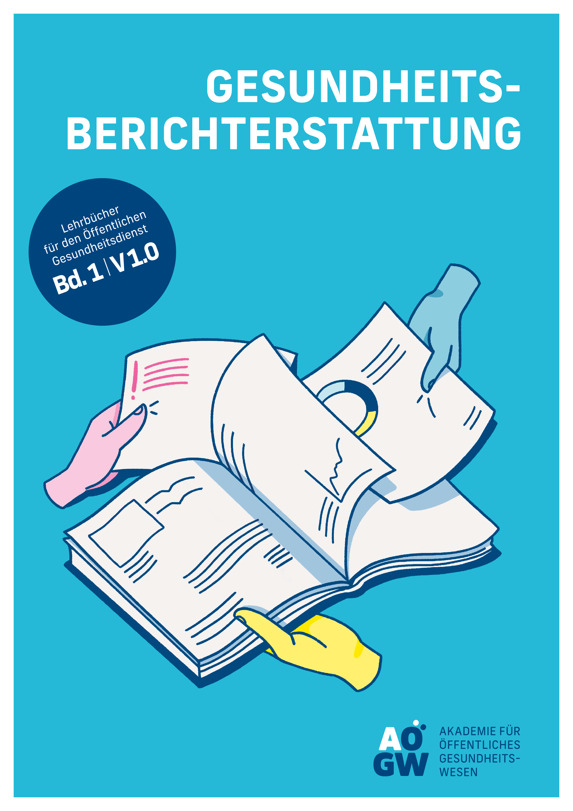

**Lehrbücher für den Öffentlichen Gesundheitsdienst Bd. 1 – V1.0**

<big style="font-size:2em;">GESUNDHEITSBERICHTERSTATTUNG</big>

Laura Arnold, Dagmar Starke (Hg.)

Laura Arnold, Thomas Claßen, Annette Galante-Gottschalk, Joseph Kuhn, Nicole Rosenkötter, Dagmar Starke, Bertram Szagun, Günter Tempel, Birgit Wollenberg, Thomas Ziese

 <figure>
  
 </figure> 

